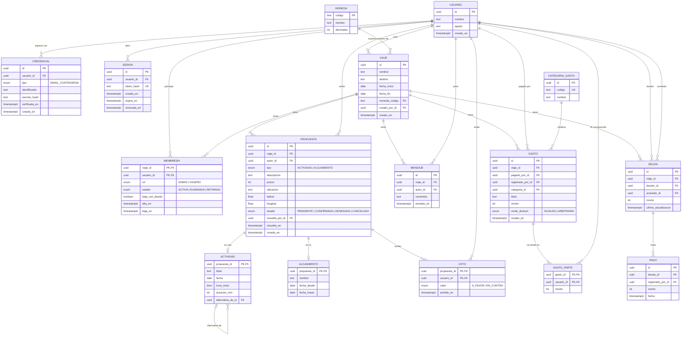

# Plan del MVP — Organizador de viajes en grupo

Este plan traduce a código el diseño de `docs/diagramas.drawio`. El alcance sale de la página "Página-13" del story mapping, que el usuario confirmó como versión final (todo lo que está antes de la línea del Release 2), y las reglas de negocio salen de los diagramas de actividad: los seis originales, actualizados con las decisiones del usuario, y dos agregados a su pedido ("Saliendo del grupo" y "Transfiriendo administración"). Las 22 preguntas abiertas de la primera versión del plan ya tienen respuesta del usuario; la sección 10 resume cada decisión (P1 a P22) y el resto del plan las cita donde se aplican. Las diferencias que esas decisiones generaban respecto de los diagramas se listan en la sección 10.2 y ya están incorporadas al `.drawio`.

## 1. Alcance del MVP y trazabilidad

El MVP cubre las 23 historias de "Página-13" más tres casos agregados por decisión del usuario: el traspaso de la administración (CU24, P5) y desvotar alojamiento y actividad (CU25 y CU26, P6). La tabla vincula cada caso con su nombre en el diagrama de casos de uso, los endpoints que lo resuelven (sección 5), las pantallas que lo muestran (sección 7) y la fase en la que se implementa (sección 8). Todas las rutas de la API cuelgan de `/api`, y las de un viaje concreto cuelgan de `/api/viajes/:viajeId`, que en la tabla se abrevia `…/`.

| # | Historia (Página-13) | Caso de uso en el diagrama | Endpoint(s) | Pantalla(s) | Fase |
|---|---|---|---|---|---|
| CU01 | Admin crea grupo | Creando grupo | `POST /api/viajes` | `/viajes` (formulario de nuevo viaje) | F2 |
| CU02 | Admin agrega viajero | Agregando viajero al viaje | `POST …/participantes` | `/viajes/:viajeId/participantes` | F2 |
| CU03 | Admin elimina participante | Eliminando participante | `DELETE …/participantes/:usuarioId` | `/viajes/:viajeId/participantes` | F2 |
| CU04 | Viajero sale del grupo | Saliendo del grupo | `POST …/salir` | `/viajes/:viajeId/participantes` | F2 |
| CU05 | Viajero propone alojamiento | Proponiendo alojamiento | `POST …/alojamientos` | `/viajes/:viajeId/alojamientos/nuevo` | F3 |
| CU06 | Viajero vota alojamiento | Votando alojamiento | `PUT …/propuestas/:propuestaId/voto` | `/viajes/:viajeId/alojamientos` | F3 |
| CU07 | Admin confirma alojamiento | Confirmando alojamiento | `POST …/propuestas/:propuestaId/confirmar` | `/viajes/:viajeId/alojamientos` | F3 |
| CU08 | Admin deniega alojamiento | Denegando alojamiento | `POST …/propuestas/:propuestaId/denegar` | `/viajes/:viajeId/alojamientos` | F3 |
| CU09 | Admin cancela alojamiento | Cancelando alojamiento | `POST …/propuestas/:propuestaId/cancelar` | `/viajes/:viajeId/alojamientos` | F3 |
| CU10 | Viajero propone actividad | Proponiendo actividad | `POST …/actividades` | `/viajes/:viajeId/actividades/nueva` | F4 |
| CU11 | Viajero propone alternativa de actividad | Proponiendo alternativa de actividad | `POST …/actividades/:actividadId/alternativas` | `/viajes/:viajeId/actividades/:actividadId/alternativa` | F4 |
| CU12 | Viajero vota actividad (incluidas alternativas) | Votando actividad | `PUT …/propuestas/:propuestaId/voto` | `/viajes/:viajeId/actividades` | F4 |
| CU13 | Admin confirma actividad | Confirmando actividad | `POST …/propuestas/:propuestaId/confirmar` | `/viajes/:viajeId/actividades` | F4 |
| CU14 | Admin deniega actividad | Denegando actividad | `POST …/propuestas/:propuestaId/denegar` | `/viajes/:viajeId/actividades` | F4 |
| CU15 | Admin cancela actividad | Cancelando actividad | `POST …/propuestas/:propuestaId/cancelar` | `/viajes/:viajeId/actividades` | F4 |
| CU16 | Viajero consulta cronograma | Consultando cronograma | `GET …/cronograma` | `/viajes/:viajeId/cronograma` | F5 |
| CU17 | Viajero visualiza mapa de actividades confirmadas y su recorrido | Consultando mapa de actividades confirmadas | `GET …/mapa` | `/viajes/:viajeId/mapa` | F5 |
| CU18 | Viajero consulta actividad en el mapa | Consultando actividad en mapa (extiende al anterior) | `GET …/actividades/:actividadId` | `/viajes/:viajeId/mapa?actividad=:actividadId` | F5 |
| CU19 | Viajero chatea con el grupo | Chateando con el grupo | `GET …/mensajes` y eventos Socket.IO `chat:enviar` / `chat:mensaje` | `/viajes/:viajeId/chat` | F6 |
| CU20 | Viajero anota gasto (categoría y división) | Anotando gasto | `POST …/gastos`, `GET …/gastos`, `GET /api/categorias-gasto` | `/viajes/:viajeId/gastos/nuevo`, `/viajes/:viajeId/gastos` | F7 |
| CU21 | Viajero consulta su deuda (a quién debe) | Consultando deuda propia | `GET …/deudas?rol=deudor` | `/viajes/:viajeId/saldos` | F7 |
| CU22 | Viajero consulta lo que le deben | Consultando lo que le deben | `GET …/deudas?rol=acreedor` | `/viajes/:viajeId/saldos` | F7 |
| CU23 | Viajero paga parte de la deuda | Registrando pago (extiende a Consultando deuda propia) | `POST …/pagos` | `/viajes/:viajeId/saldos/pagar/:acreedorId` | F8 |
| CU24 | Admin transfiere la administración (agregado por P5) | No figura | `POST …/administracion/traspaso`, `POST …/salir` con `nuevoAdminId` | `/viajes/:viajeId/participantes` | F2 |
| CU25 | Viajero desvota alojamiento (agregado por P6) | Desvotando alojamiento | `DELETE …/propuestas/:propuestaId/voto` | `/viajes/:viajeId/alojamientos` | F3 |
| CU26 | Viajero desvota actividad (agregado por P6) | Desvotando actividad | `DELETE …/propuestas/:propuestaId/voto` | `/viajes/:viajeId/actividades` | F4 |

El registro, el inicio y el cierre de sesión no figuran en los diagramas, pero todos los casos anteriores los necesitan para identificar al viajero; se implementan en F2 como soporte transversal según P3.

**Revisión de F9.** Las rutas y pantallas de la tabla coinciden con lo implementado. La prueba `apps/api/test/unitarias/trazabilidad.test.ts` lee esta tabla y la sección 6, y falla si algún caso de uso o alguna regla no aparece en el nombre de al menos una prueba de `apps/*/test` o de `e2e/`. Los flujos de punta a punta de `e2e/` recorren CU01, CU02, CU04, CU10, CU13, CU16 a CU21, CU23 y CU24 en el navegador.

## 2. Arquitectura y estructura del repositorio

### 2.1 Vista general

La aplicación tiene tres piezas que corren por separado en desarrollo:

- **Frontend (`apps/web`)**: aplicación de una sola página en Vue 3 con Vite, Vue Router y Pinia. Habla con el backend por HTTP (JSON) para consultas y modificaciones, y por Socket.IO para el chat y los avisos en tiempo real.
- **Backend (`apps/api`)**: servidor Express que expone la API REST bajo `/api` y monta Socket.IO sobre el mismo servidor HTTP.
- **Base de datos**: PostgreSQL, levantada con Docker Compose en desarrollo y en las pruebas.

El paquete `packages/compartido` contiene los esquemas de validación (Zod), los tipos que se derivan de ellos y los enumerados estables del dominio (estados de propuesta, roles, modos de división). El backend lo usa para validar y el frontend para validar formularios y tipar las respuestas, de modo que un cambio de contrato rompe la compilación de ambos lados.

En desarrollo, Vite redirige `/api` y `/socket.io` al backend, así el navegador ve un único origen y la cookie de sesión funciona sin abrir CORS.

### 2.2 Principios de diseño y patrones obligatorios

El código cumple SOLID y GRASP y usa patrones de diseño donde resuelven un problema concreto, sin sobreingeniería. Las tres exigencias se combinan con un criterio único para decidir cuándo agregar una abstracción, detallado en 2.2.4.

#### 2.2.1 SOLID

Los principios SOLID se cumplen estrictamente en todo el código. La única excepción es el uso de un patrón de diseño que, por su naturaleza, relaje alguno de ellos (por ejemplo, una Fachada que agrupa operaciones o un Visitor que exige tocar a los visitantes cuando aparece un tipo nuevo); en ese caso prevalece el patrón y se registra en `LOG.md` qué patrón se usó, qué principio relaja y por qué. Agregar una funcionalidad modifica, como mínimo, el punto de composición y las rutas; la regla se interpreta como que esas modificaciones quedan concentradas ahí y que la lógica existente no se edita para extenderla.

Cómo se traduce cada principio en este proyecto:

| Principio | Aplicación |
|---|---|
| Responsabilidad única | Cada capa tiene una sola tarea (sección 2.3) y cada caso de uso es una clase propia. Por ejemplo, el módulo de gastos tiene `AnotarGasto`, `ConsultarDeudas` y `RegistrarPago` en lugar de un servicio con todas las operaciones. Los componentes Vue de presentación reciben datos por props y emiten eventos, y las vistas coordinan stores y componentes. |
| Abierto/cerrado | Toda dependencia externa y toda regla que ya tiene más de una variante en los requerimientos actuales van detrás de una interfaz, y los comportamientos nuevos se agregan como clases nuevas. Los puntos de extensión del MVP son `EstrategiaDivision` (partes iguales y arbitraria), `BuscadorUbicaciones` (D8, servicio externo) y `ReglaAlResolver` (reglas de actividades al resolver una propuesta). Las variaciones que el story mapping anticipa para releases futuros no se preparan de antemano: la abstracción se introduce cuando el release que la necesita pase a ser un requerimiento (sección 9). Los catálogos que pueden crecer, como categorías de gasto y monedas, son datos en tablas y no enumerados en el código (P16). |
| Sustitución de Liskov | Cada interfaz tiene un conjunto de pruebas de contrato que corre contra todas sus implementaciones, incluidos los repositorios en memoria que usan las pruebas unitarias y los de Prisma. |
| Segregación de interfaces | Las interfaces se definen según lo que necesita quien las usa. Por ejemplo, `RegistrarPago` depende de un repositorio con `obtenerDeudaBloqueada`, `restar` y `guardarPago`, y no de un repositorio con todas las operaciones de deudas. |
| Inversión de dependencias | Los casos de uso dependen de interfaces de repositorio y de una `UnidadDeTrabajo` para las transacciones, nunca de Prisma. Las implementaciones con Prisma viven en la capa de infraestructura y se conectan en un único punto de composición (`contenedor.ts`). En el frontend, los stores dependen de interfaces de cliente de API que se inyectan al crear la aplicación. |

#### 2.2.2 GRASP

| Principio | Aplicación |
|---|---|
| Experto en información | Cada regla vive en la clase que tiene los datos para aplicarla, así que las entidades del dominio tienen comportamiento y no son solo contenedores de datos. `Propuesta` conoce sus transiciones válidas (`confirmar()`, `denegar()`, `cancelar()`) y quién puede votarla; `Deuda` sabe sumar, restar un pago (rechazando el exceso) y compensarse con la deuda en sentido opuesto; `Viaje` sabe si una fecha o un rango caen dentro de él y cuál es su día inicial para el mapa; el `Intervalo` de una `Actividad` sabe si se superpone con otro; `Membresia` sabe si da acceso completo o solo a saldos. |
| Creador | `Viaje` crea la membresía de su Admin al crearse; `Actividad` crea sus alternativas (`crearAlternativa()`), lo que aplica la regla de "sin cadenas" en un solo lugar; `Gasto` crea sus partes a partir de la `EstrategiaDivision`. |
| Controlador | Cada caso de uso (`AnotarGasto`, `ResolverPropuesta`, `SalirDelViaje`, etc.) es el controlador de su operación del sistema: carga las entidades, les pide que actúen, aplica las políticas que involucran a varias entidades y guarda dentro de una `UnidadDeTrabajo`. Los controladores HTTP y el gateway de Socket.IO solo traducen. |
| Bajo acoplamiento | Los módulos de dominio se comunican entre sí por interfaces y eventos, nunca por sus implementaciones; el dominio no conoce Express, Prisma ni Socket.IO. |
| Alta cohesión | Cada módulo agrupa un solo tema del dominio y cada clase tiene un propósito acotado. |
| Polimorfismo | Las variantes que ya existen se resuelven con implementaciones de una interfaz y no con condicionales por tipo: modos de división, búsqueda de ubicaciones y reglas al resolver propuestas. |
| Fabricación pura | Repositorios, `UnidadDeTrabajo` y `NotificadorViaje` no son conceptos del dominio; existen para que las entidades no dependan de la persistencia ni de la mensajería. |
| Indirección | Las interfaces de repositorio y de proveedores median entre el dominio y la infraestructura. |
| Variaciones protegidas | Las interfaces se ponen en las dependencias externas y en las variaciones que ya existen en los requerimientos actuales; es el mismo criterio con el que se aplica abierto/cerrado. |

#### 2.2.3 Patrones de diseño

Patrones que usa el proyecto:

| Patrón | Dónde | Por qué hace falta |
|---|---|---|
| Strategy | `EstrategiaDivision`, `BuscadorUbicaciones` | Variaciones que ya existen: dos modos de división, y la búsqueda de ubicaciones aislada del servicio externo (Nominatim). Las variaciones previstas para releases futuros (subgrupos, rutas por calles, otras formas de ingreso) se resuelven cuando lleguen, con la opción más simple que pida `CLAUDE.md`. |
| Repository | Acceso a datos de cada módulo | Separa el dominio de Prisma y permite probar con repositorios en memoria. |
| Unit of Work | `UnidadDeTrabajo` | Agrupa las escrituras de un caso de uso en una transacción sin que el caso de uso conozca la base. |
| Adapter | Implementaciones con Prisma, argon2, Nominatim y Socket.IO | Aíslan cada librería externa detrás de una interfaz del dominio. |
| Observer, como eventos de dominio | Baja de participante y traspaso de Admin publican un evento que `NotificadorViaje` entrega por Socket.IO | El módulo de viajes no conoce el chat ni Socket.IO. |
| Value Object | `Dinero` (monto entero y moneda), `RangoFechas`, `Intervalo` | Encapsulan reglas pequeñas y repetidas (reparto con resto, pertenencia a un rango, superposición) en objetos inmutables, en lugar de números y fechas sueltos. |
| Composition Root | `contenedor.ts` en el backend y `main.ts` en el frontend | Único lugar donde se eligen las implementaciones. |
| Chain of Responsibility | Middlewares de Express | Lo provee Express; no se construye nada propio. |
| Decorator | `PropuestasConAgendaBloqueadaPrimero`, que envuelve al repositorio de propuestas en la transacción de resolución | Al confirmar dos opciones del mismo grupo a la vez, las transacciones tomaban los bloqueos en distinto orden y PostgreSQL cortaba una por bloqueo mutuo. El decorador bloquea la agenda del viaje antes de cargar la propuesta, así el orden es siempre el mismo, sin modificar `ResolverPropuesta`. Se descartó sumar un método "antes de cargar" a `ReglaAlResolver`, porque cambiaba su contrato por una necesidad de infraestructura. Se agregó en F4 y el usuario lo aprobó después, en la revisión contra `CLAUDE.md`. |

Patrones y técnicas que se descartan por sobreingeniería:

| Descartado | Motivo |
|---|---|
| State para los estados de propuesta | Con cuatro estados y tres transiciones, una tabla de transiciones dentro de `Propuesta` es más clara que una clase por estado. |
| Repositorio genérico | Mezclaría operaciones que cada caso de uso no necesita y va contra la segregación de interfaces. |
| Abstract Factory | No hay familias de objetos que varíen juntas. |
| CQRS y reconstrucción del estado a partir de eventos | El volumen y la complejidad de consultas del MVP no lo justifican. |
| Contenedor de inyección de dependencias | La inyección manual alcanza (D14). |
| Microservicios | Un solo equipo y un solo despliegue; un monolito modular cubre la necesidad. |

#### 2.2.4 Criterio contra la sobreingeniería

Una abstracción (interfaz, patrón o capa adicional) se agrega solo si cumple al menos una de estas condiciones: aísla una dependencia externa, cubre una variación que ya existe en los requerimientos actuales, o es necesaria para probar una regla sin infraestructura. Si no cumple ninguna, se implementa de la forma directa. Anticipar variaciones que solo figuran en releases futuros del story mapping se considera sobreingeniería, y cuando dos principios chocan se elige la opción más simple que resuelva el requerimiento actual (`CLAUDE.md`). Cada patrón que se agregue durante la implementación y no figure en 2.2.3 se registra en `LOG.md` con la condición que lo justifica.

### 2.3 Capas del backend

Cada módulo de dominio sigue el mismo recorrido de una petición:

1. **Rutas**: declaran el endpoint y encadenan los middlewares de autenticación, acceso al viaje, rol y validación.
2. **Controlador**: traduce entre HTTP y el caso de uso, sin reglas de negocio.
3. **Caso de uso**: coordina la operación como controlador de GRASP, cargando las entidades con los repositorios, delegándoles las reglas de las que son expertas, aplicando las políticas que involucran a varias entidades y guardando todo dentro de una `UnidadDeTrabajo`.
4. **Dominio**: entidades con comportamiento, objetos de valor, funciones de reglas que involucran a varias entidades, eventos, errores de dominio e interfaces de repositorio.
5. **Infraestructura**: implementaciones con Prisma, argon2, Nominatim y Socket.IO de las interfaces del dominio.

El gateway de Socket.IO es otro adaptador de entrada, como el controlador, y usa los mismos casos de uso.

### 2.4 Estructura de carpetas

```text
/
├── apps/
│   ├── api/
│   │   ├── prisma/
│   │   │   ├── schema.prisma          # esquema de la base (sección 4)
│   │   │   ├── migrations/            # migraciones de Prisma, con SQL agregado para CHECK e índices parciales
│   │   │   └── seed.ts                # categorías, monedas y datos de ejemplo
│   │   ├── src/
│   │   │   ├── app.ts                 # arma Express, middlewares globales y rutas
│   │   │   ├── servidor.ts            # levanta HTTP y Socket.IO
│   │   │   ├── contenedor.ts          # punto de composición: crea implementaciones e inyecta dependencias
│   │   │   ├── config.ts              # lectura y validación de variables de entorno
│   │   │   ├── compartido/            # UnidadDeTrabajo, errores y eventos de dominio, objetos de valor Dinero, RangoFechas e Intervalo
│   │   │   ├── middlewares/           # autenticado, verificarOrigen, participanteActivo, accesoSaldos, soloAdmin, validar, manejarErrores
│   │   │   └── modulos/
│   │   │       ├── auth/              # registro, sesiones, credenciales (P3)
│   │   │       ├── viajes/            # grupo, participantes y traspaso (CU01–CU04, CU24)
│   │   │       ├── propuestas/        # votos y transiciones comunes (CU06–CU09, CU12–CU15, CU25, CU26)
│   │   │       ├── alojamientos/      # CU05
│   │   │       ├── actividades/       # CU10, CU11, CU18 y políticas de P9 y P10
│   │   │       ├── itinerario/        # cronograma y mapa (CU16, CU17)
│   │   │       ├── chat/              # historial REST y gateway Socket.IO (CU19)
│   │   │       └── gastos/            # gastos, deudas y pagos (CU20–CU23)
│   │   │           # cada módulo: <modulo>.rutas.ts (rutas y controlador, que es delgado), casos-de-uso/, dominio/, infraestructura/
│   │   └── test/
│   │       ├── unitarias/             # casos de uso con repositorios en memoria
│   │       ├── contratos/             # pruebas de contrato de cada interfaz
│   │       └── integracion/           # API con Supertest contra PostgreSQL
│   └── web/
│       ├── src/
│       │   ├── main.ts                # crea la app e inyecta los clientes de API
│       │   ├── App.vue
│       │   ├── router/                # rutas y guardas de sesión, rol y acceso a saldos
│       │   ├── vistas/                # una vista por pantalla (sección 7)
│       │   ├── componentes/           # componentes de presentación por dominio
│       │   ├── stores/                # stores de Pinia
│       │   ├── clientes/              # interfaces de cliente de API y sus implementaciones HTTP y Socket.IO
│       │   └── composables/           # lógica reutilizable de vistas (por ejemplo, el mapa)
│       └── test/                      # pruebas de componentes con Vitest y Vue Test Utils
├── packages/
│   └── compartido/
│       └── src/                       # esquemas Zod, tipos y enumerados estables
├── e2e/                               # pruebas de punta a punta con Playwright
├── docs/
│   ├── diagramas.drawio               # fuente del diseño
│   └── api.md                         # referencia de la API, se mantiene al día desde F2
├── docker-compose.yml                 # PostgreSQL para desarrollo y pruebas
├── package.json                       # workspaces de npm y scripts de raíz
├── .env.example
├── README.md
├── PLAN.md
└── LOG.md
```

## 3. Decisiones técnicas

Vue y Express están fijados por la consigna. El resto se decide acá; cada decisión nueva que surja durante la implementación se agrega al final de esta tabla y se registra en `LOG.md`.

| # | Tema | Opción elegida | Justificación | Alternativa descartada y motivo |
|---|---|---|---|---|
| D1 | Lenguaje | TypeScript en frontend, backend y paquete compartido | El dominio tiene muchos estados y montos que se cruzan entre capas; con tipos compartidos un error de contrato aparece al compilar. Además, las interfaces de TypeScript son la herramienta para aplicar inversión de dependencias y segregación de interfaces (sección 2.2). | JavaScript: menos configuración inicial, pero sin interfaces verificadas por el compilador los contratos entre capas dependerían de la disciplina de cada uno. |
| D2 | Organización del repo | Monorepo con workspaces de npm (`apps/api`, `apps/web`, `packages/compartido`) | Permite compartir esquemas sin publicar paquetes y levantar todo con un solo `npm install`. npm ya viene con Node. | Dos repositorios separados: duplicaría tipos y validaciones. pnpm o Turborepo: aportan velocidad que un proyecto de este tamaño no necesita. |
| D3 | Base de datos | PostgreSQL 16 en Docker Compose | El modelo es relacional (membresías, votos, deudas entre pares) y las operaciones de dinero necesitan transacciones, restricciones `CHECK` y `UNIQUE`, índices parciales y bloqueo de filas. | MongoDB: la consistencia de saldos entre documentos exigiría lógica manual. SQLite: sin bloqueo por fila y distinto del motor de producción. |
| D4 | Acceso a datos | Prisma ORM con migraciones versionadas, usado solo desde la capa de infraestructura | Genera un cliente tipado, maneja migraciones y soporta transacciones interactivas, que implementan la `UnidadDeTrabajo`. El bloqueo de filas de deudas se hace con `SELECT … FOR UPDATE` dentro de la transacción. | Sequelize: tipado débil. Knex o SQL a mano: habría que mantener tipos y migraciones por separado. |
| D5 | Autenticación | Email y contraseña sin envío de correos (P3). Hash con argon2id mediante `@node-rs/argon2`. Sesiones guardadas en la base: token aleatorio de 256 bits en cookie `httpOnly`, `Secure` en producción y `SameSite=Lax`, del que la base guarda solo el hash, con vencimiento y revocación | argon2id es el algoritmo recomendado por OWASP y `@node-rs/argon2` trae binarios precompilados. Las sesiones en la base se pueden anular en el momento (cierre de sesión, sospecha de robo), a diferencia de un JWT, que vale hasta que expira. La cookie `httpOnly` no queda expuesta al JavaScript del navegador y Socket.IO la recibe en el handshake. | JWT en cookie: no se puede revocar antes de su vencimiento. `bcryptjs`: seguro con costo alto, pero argon2id resiste mejor ataques con hardware dedicado. Token en `localStorage`: expuesto a XSS. Proveedor externo (Auth0, Firebase): dependencia innecesaria para el MVP. |
| D6 | Medidas de seguridad de la autenticación | Contraseña de 8 a 128 caracteres con rechazo de contraseñas comunes (lista local); email normalizado en minúsculas y sin espacios; mismo mensaje y mismo tiempo de respuesta con email existente o inexistente al ingresar; límite de 5 ingresos fallidos por email o por IP cada 15 minutos y límite general al registro (`express-rate-limit`); verificación del encabezado `Origin` en toda petición que modifica datos y en el handshake de Socket.IO; encabezados con `helmet`; CORS cerrado al propio origen; secretos en `.env`; nunca se registran contraseñas ni tokens en logs | Cubre fuerza bruta, enumeración de usuarios en el ingreso, CSRF y filtración de secretos, que son los riesgos principales de un ingreso con contraseña sin segundo factor. El mínimo de 8 caracteres lo pidió el usuario, y el rechazo de contraseñas comunes junto con el límite de intentos compensan un mínimo corto. | Mínimo de 12 caracteres: más robusto, descartado por decisión del usuario. Contador de intentos en la base: persistente entre reinicios, pero agrega escrituras en cada ingreso; para el MVP alcanza el almacenamiento en memoria del limitador. |
| D7 | Extensibilidad de la autenticación | Identidad (`usuario`) separada de las formas de ingresar (`credencial`), la clase `EmailContrasena` para la única forma de ingreso del MVP y búsqueda de usuarios por `buscarPorIdentificador(tipo, valor)` | El modelo de datos ya admite varias credenciales por cuenta, así que sumar teléfono u otro proveedor no toca sesiones, permisos ni módulos de negocio; la interfaz común entre proveedores se introduce cuando exista el segundo. | Email y contraseña como columnas de `usuario`: más simple hoy, pero cada forma de ingreso nueva obligaría a modificar la tabla y el servicio de sesiones. |
| D8 | Búsqueda de ubicaciones | Interfaz `BuscadorUbicaciones` en el frontend con implementación sobre Nominatim (OpenStreetMap), consultado directamente desde el navegador, más la opción de marcar el punto con un clic en el mapa | Proponer actividades exige coordenadas (P8). Nominatim es gratuito; se respeta su límite de uso con espera entre teclas y el clic en el mapa sirve de alternativa si el servicio falla. | Google Places: mejor autocompletado, pero con clave y facturación. |
| D9 | Mapa | Leaflet con teselas de OpenStreetMap, usado directamente dentro de un componente Vue | Libre, sin clave ni facturación y suficiente para marcadores y polilíneas. | Google Maps JavaScript API: requiere clave con facturación. Mapbox GL: requiere token y es más pesado. |
| D10 | Trazado del recorrido | Función `recorridoEnLineaRecta`, que une los marcadores en orden cronológico (P20) | Cumple "traza el recorrido entre ellas según ese orden" sin servicios externos. Cuando el trazado por calles del Release 4 sea un requerimiento, se introduce la abstracción para el servicio externo. | OpenRouteService u OSRM desde el MVP: clave o servidor sin garantías, y adelantan funcionalidad del Release 4. |
| D11 | Chat en tiempo real | Socket.IO, una sala por viaje (`viaje:<id>`) | Resuelve reconexión automática, salas y confirmación de recepción. Las salas encajan con los canales por subgrupo del Release 3. | WebSocket nativo (`ws`): habría que implementar reconexión, salas y confirmaciones. Consultas periódicas o SSE: más latencia y, en SSE, un solo sentido. |
| D12 | Validación | Zod en `packages/compartido`, aplicado en el middleware `validar` y en los formularios | Un solo esquema define la forma de los datos y los mensajes de error en ambos lados. | express-validator o Joi: solo sirven en el backend y obligan a duplicar reglas en los formularios. |
| D13 | Estado en Vue | Pinia, un store por dominio, con los clientes de API inyectados | Librería de estado oficial de Vue 3, con buen soporte de TypeScript. Inyectar los clientes permite probar los stores con clientes falsos. | Vuex: en modo mantenimiento. Solo composables: sirven para estado local, pero la sesión, el viaje actual y el chat se comparten entre muchas vistas. |
| D14 | Inyección de dependencias | Manual, en `contenedor.ts` del backend y en `main.ts` del frontend | Hace explícito qué implementación recibe cada caso de uso, sin decoradores ni metadatos en tiempo de ejecución, y es fácil de seguir para quien no conoce el proyecto. | InversifyJS o tsyringe: automatizan la resolución, pero agregan decoradores, `reflect-metadata` y una capa de configuración que el tamaño del proyecto no justifica. |
| D15 | Pruebas | Vitest en backend y frontend; pruebas unitarias de casos de uso con repositorios en memoria; pruebas de contrato por interfaz; Supertest contra una base PostgreSQL de prueba; Vue Test Utils para componentes; Playwright para los flujos de punta a punta | Las pruebas unitarias corren rápido sin base, las de contrato garantizan que las implementaciones en memoria y las de Prisma se comportan igual (sustitución de Liskov) y las de integración verifican restricciones, transacciones y bloqueos reales. | Jest: configuración extra para ESM y TypeScript. Probar todo contra la base: lento y acopla las reglas a la infraestructura. |
| D16 | Representación de montos | Enteros en la unidad mínima de la moneda del viaje (centavos para pesos, dólares o euros); el formateo se hace solo en la interfaz con `Intl.NumberFormat` según el código de la moneda | Evita errores de redondeo al dividir gastos y restar pagos, y funciona con monedas sin decimales. En la división en partes iguales, las unidades sobrantes se asignan de a una a los primeros deudores del listado (P13). | `float` como en el modelo conceptual: 0,1 + 0,2 ≠ 0,3 y los saldos dejarían de cerrar. `DECIMAL`: llega a JavaScript como texto y obliga a una librería de decimales. |
| D17 | Fechas y horarios | Fecha (`DATE`) y hora de inicio (`TIME`) sin zona horaria, interpretadas como hora local del destino; duración en minutos; "hoy" es la fecha del dispositivo del viajero, que el frontend envía en la petición (P19) | Las actividades se planifican en la hora del lugar. Tomar "hoy" del dispositivo evita que servidor y viajero estén en días distintos cerca de medianoche. | `TIMESTAMPTZ`: obligaría a guardar la zona del destino, que el modelo no tiene. "Hoy" del servidor: falla con viajes a otro huso horario. |
| D18 | Consistencia de saldos | Crear un gasto o registrar un pago ocurre en una sola transacción que bloquea las filas de deuda involucradas | Dos operaciones simultáneas no pueden dejar una deuda negativa, duplicar una compensación ni superar el saldo que se validó. | Aislamiento `SERIALIZABLE` con reintentos: también correcto, pero agrega manejo de reintentos en cada caso de uso. |
| D19 | Formato de errores | Todas las respuestas de error tienen la forma `{ "error": { "codigo", "mensaje", "detalles" } }` con códigos estables en mayúsculas (sección 5.1) | El frontend decide qué mostrar según el código y las pruebas verifican el código exacto. | Solo el código HTTP: no distingue, por ejemplo, superposición horaria de propuesta ya resuelta. |
| D20 | Estilos | CSS propio con variables y un puñado de componentes base (botón, campo, aviso, diálogo) | Las pantallas son formularios y listas; una librería de componentes agregaría peso y un sistema de diseño propio. | Vuetify o PrimeVue: aceleran pantallas complejas, pero imponen su sistema y aumentan el tamaño del paquete. |
| D21 | Calidad de código | ESLint (con `eslint-plugin-vue`) y Prettier en `npm run lint` | Estándar en proyectos Vue con TypeScript. | Biome: soporte parcial de archivos `.vue`. |
| D22 | Ubicación de las reglas de negocio | Modelo de dominio con comportamiento: entidades y objetos de valor que aplican las reglas de las que son expertos, y casos de uso que coordinan (sección 2.2.2) | Cumple el principio de experto en información de GRASP, evita repetir una misma regla en varios casos de uso y permite probar las reglas sin repositorios ni base. | Modelo anémico con toda la lógica en servicios: más directo al principio, pero dispersa reglas como la superposición o la resta de una deuda entre varios casos de uso. |
| D23 | Versiones y herramientas de base (F0) | TypeScript 6, Express 5, Zod 4, Vue 3.5, Vue Router 5, Pinia 4, Vite 8 y Vitest 5, las versiones estables vigentes al empezar F0; `happy-dom` como entorno de pruebas de componentes; `concurrently` para levantar los tres paquetes en desarrollo; `tsx` para el backend en desarrollo; `process.loadEnvFile()` de Node para leer `.env`; el paquete compartido se compila a `dist` como módulo ES | Empezar con versiones vigentes evita migraciones durante el cuatrimestre. `happy-dom` es más liviano que `jsdom` y alcanza para montar componentes. `process.loadEnvFile()` viene con Node 22 y evita una dependencia. Compilar el paquete compartido permite que el backend compilado lo importe con Node sin transpilar en tiempo de ejecución. | `jsdom`: más completo pero más pesado. `dotenv`: dependencia innecesaria con Node 22. Importar el paquete compartido como TypeScript sin compilar: funciona en desarrollo pero no con `node dist/servidor.js`. |
| D24 | Montos en la base y en el dominio (F1) | Columnas `BIGINT` en PostgreSQL y enteros seguros de JavaScript (`number`, hasta 2^53) en el dominio, con la conversión en los repositorios; el objeto de valor `Dinero` rechaza montos que no sean enteros seguros | Un `INTEGER` de 32 bits llega a unos 21 millones de pesos en centavos, un límite alcanzable para las deudas acumuladas de un viaje en pesos. `number` evita que `bigint` llegue al JSON de la API, que no lo serializa. | `INTEGER`: límite demasiado bajo. `bigint` de JavaScript en todo el dominio: obliga a convertir en cada respuesta y complica los cálculos. |
| D25 | Integración continua | GitHub Actions (`.github/workflows/ci.yml`) en cada pull request y en cada push a `main`, con tres trabajos en paralelo: lint y tipos, pruebas de Vitest y pruebas de punta a punta. Las pruebas usan PostgreSQL 16 como servicio, con la misma base y el mismo puerto que `db-test` de `docker-compose.yml`. | Repite en GitHub las verificaciones que el README pide correr a mano, sin variables de entorno nuevas; los trabajos separados muestran enseguida qué parte falló. | Un único trabajo con todos los pasos: más lento y con un solo resultado. Disparar también en cada push a cualquier rama: duplicaba las corridas de las ramas con pull request abierto. |

## 4. Modelo de datos

### 4.1 Del diagrama conceptual al esquema

El "Diagrama conceptual" tiene diez clases: Viaje, Viajero, Admin (subclase de Viajero), Propuesta (abstracta) con sus subclases Actividad y Alojamiento, Mensaje, Gasto, Deuda y Pago. Sus relaciones son: Admin crea Viaje (1 — 1..\*), Viaje tiene Gasto, Mensaje y Propuesta (1 — 0..\*), Viajero emite Propuesta, es autor de Mensaje, paga Gasto ("pagado por") y participa de Deuda como deudor y como acreedor (1 — 0..\*), Gasto suma a Deuda (1 — 0..\*) y Pago resta a Deuda (0..\* — 1).

El esquema agrega lo que los diagramas de actividad y las decisiones del usuario exigen:

| Agregado | Decisión |
|---|---|
| Tabla `membresia` con rol y estado por viaje | P2, P18 |
| Tablas `credencial` y `sesion`; `usuario` queda solo con el perfil | P3, D5, D7 |
| `hora_inicio` y `duracion_min` en actividad; `latitud` y `longitud` en propuesta; `nombre` en alojamiento; `precio` como total estimado opcional | P8 |
| `alternativa_de_id` en actividad | P9 |
| Tabla `gasto_parte`; deuda acumulada por par | P12, P14 |
| Tabla `categoria_gasto` | P16 |
| Tabla `moneda` y `moneda_codigo` en viaje | P16 |
| `registrado_por_id` en pago | P17 |
| `registrado_por_id` en gasto, distinto de `pagado_por_id` | P12 |
| `resuelta_por_id` y `resuelta_en` en propuesta | P7 |

Los tipos del conceptual se adaptan así: los montos `float` pasan a enteros en la unidad mínima de la moneda (D16), `duración: float` pasa a minutos enteros, `Fecha` pasa a `DATE` o `TIMESTAMPTZ` según sea un día del viaje o un instante de registro (D17), `RangoFechas` pasa a `fecha_desde` y `fecha_hasta`, `EstadoPropuesta` toma los valores de P7 y `CategoriaGasto` pasa a ser una tabla (P16).

### 4.2 DER



Todos los montos (`precio`, `gasto.monto`, `gasto_parte.monto`, `deuda.monto`, `pago.monto`) son enteros en la unidad mínima de la moneda del viaje.

### 4.3 Restricciones del esquema

| Tabla | Restricción | Motivo |
|---|---|---|
| `credencial` | `UNIQUE (tipo, identificador)`; el identificador se guarda normalizado | Una credencial identifica a una sola persona y el mismo email no se registra dos veces con distinta escritura (D6). |
| `sesion` | `UNIQUE (token_hash)`; índice por `usuario_id` | Búsqueda de la sesión por el hash del token y revocación de todas las sesiones de un usuario. |
| `moneda` | `CHECK (decimales BETWEEN 0 AND 4)` | Cantidad de decimales razonable para formatear montos. |
| `viaje` | `CHECK (fecha_inicio <= fecha_fin)`; FK a `moneda` | Rango válido, del que dependen el mapa, el cronograma y P11. |
| `membresia` | PK `(viaje_id, usuario_id)`; índice parcial único `(viaje_id) WHERE rol = 'ADMIN' AND estado = 'ACTIVA'`; `CHECK` de que `baja_en` exista solo si la membresía no está activa | Un viajero figura una sola vez por viaje, por lo que volver a agregarlo reactiva su membresía (P18), cada viaje tiene un único Admin activo (P2, P5) y la fecha de baja es coherente con el estado. |
| `propuesta` | `CHECK` de que `latitud` y `longitud` sean ambas nulas o ambas no nulas y estén en rango (±90 y ±180); `CHECK (precio IS NULL OR precio >= 0)`; índice `(viaje_id, tipo, estado)` | Consistencia de coordenadas, precio opcional no negativo (P8) y consultas rápidas de actividades confirmadas. Que las actividades tengan coordenadas lo exige el caso de uso. |
| `actividad` | `CHECK (duracion_min > 0)`; FK `alternativa_de_id → actividad.propuesta_id` | Duración positiva y vínculo con la actividad original (P9). |
| `alojamiento` | `CHECK (fecha_desde <= fecha_hasta)` | Rango válido. |
| `voto` | PK `(propuesta_id, usuario_id)` | Un viajero tiene como mucho un voto por propuesta. |
| `gasto` | `CHECK (monto > 0)`; FK a `categoria_gasto` | Monto positivo y categoría existente. |
| `gasto_parte` | `CHECK (monto >= 0)`; la suma por gasto se valida en el caso de uso dentro de la transacción | La suma debe coincidir con el total del gasto (RN-G4). |
| `deuda` | `UNIQUE (viaje_id, deudor_id, acreedor_id)`; `CHECK (deudor_id <> acreedor_id)`; `CHECK (monto >= 0)` | Una fila acumulada por par y sentido, nadie se debe a sí mismo y un pago nunca deja saldo negativo. Por la compensación de P15, entre dos viajeros solo una de las dos filas posibles tiene monto mayor que cero. |
| `pago` | `CHECK (monto > 0)` | Monto positivo. |

Ninguna tabla borra filas de `usuario` ni de `membresia`: las bajas son lógicas, con `estado` y `baja_en`, para que los gastos, mensajes, propuestas y deudas sigan apuntando a un viajero existente (P18).

### 4.4 Justificación de los mapeos

**Herencia Admin/Viajero.** En el conceptual, Admin es una subclase de Viajero y "crea" viajes. Si Admin fuera un tipo de usuario fijo, una misma persona no podría ser Admin del viaje que creó y viajero común en el viaje de un amigo. Por eso la identidad vive en una sola tabla `usuario` y la especialización pasa a ser un rol por viaje en `membresia.rol`, que vale `ADMIN` para quien crea el viaje y puede cambiar de dueño con el traspaso de CU24 (P2, P5). `viaje.creado_por_id` conserva la relación "crea" del conceptual. Se descartaron una tabla `admin` separada, porque fijaría el rol a la persona y no al viaje, y una columna `es_admin` en `usuario`, por el mismo motivo.

**Propuesta abstracta con Actividad y Alojamiento.** Se usa una tabla por clase con tabla base: `propuesta` guarda los atributos comunes del conceptual (descripción, precio, ubicación, estado) más el autor, el viaje y las coordenadas, y `actividad` y `alojamiento` tienen como clave primaria la misma `propuesta_id` y agregan sus atributos propios. La columna `tipo` indica qué subtabla completa a cada propuesta. Así los votos y las transiciones de estado apuntan a una sola tabla y cada subclase mantiene sus columnas obligatorias como `NOT NULL`. Se descartaron una tabla única con columnas nulas para ambos tipos, porque no permitiría exigir `fecha` en actividades ni `fecha_desde` en alojamientos, y dos tablas concretas sin base común, porque obligarían a duplicar votos y estados o a usar una clave foránea polimórfica que la base no puede verificar.

**Votos a favor y en contra.** El conceptual modela `aFavor: list[Viajero]` y `enContra: list[Viajero]` dentro de Propuesta. El esquema usa una única tabla `voto` con la columna `valor` y clave primaria `(propuesta_id, usuario_id)`, lo que garantiza que un viajero no esté a la vez en las dos listas. Votar es un `upsert` (cambiar de a favor a en contra reemplaza el valor) y desvotar borra la fila (P6). Las listas del conceptual se obtienen filtrando por `valor`. Se descartaron dos tablas de relación (`voto_a_favor`, `voto_en_contra`) porque permitirían que el mismo viajero apareciera en ambas sin una restricción adicional entre tablas.

**Deuda y Pago.** La actividad "Anotando gasto" termina con "Actualiza el total a pagar de cada deudor", y Deuda tiene `ultimaActualizacion`, lo que indica una deuda acumulada. Por eso `deuda` guarda una fila por viaje, deudor y acreedor con el saldo pendiente (P14). Cada gasto registra en `gasto_parte` cuánto le corresponde a cada deudor; al guardarlo, cada parte de un deudor distinto del pagador se compensa primero contra lo que el pagador le debía a ese deudor y el resto se suma a la deuda del deudor con el pagador (P15). Cada pago apunta a la fila de deuda que salda (relación "resta" del conceptual) y resta su monto. Ambas operaciones corren en una transacción con bloqueo de las filas afectadas (D18). La relación "suma" entre Gasto y Deuda queda representada de forma indirecta, a través de `gasto_parte` y del par deudor–acreedor, porque la cardinalidad Gasto 1 — 0..\* Deuda haría que cada deuda perteneciera a un único gasto. Una prueba de invariante verifica que, para cada par de viajeros, el saldo neto guardado en `deuda` sea igual al saldo neto calculado a partir de las partes de gastos y los pagos. Se descartaron una deuda por gasto, porque un pago que cubre varios gastos tendría que restar a varias deudas, y no guardar la deuda, porque el conceptual la trata como entidad y el pago necesita una deuda concreta a la cual restar.

## 5. API

### 5.1 Convenciones

- Base `/api`, cuerpo y respuestas en JSON, montos como enteros en la unidad mínima de la moneda del viaje, fechas `YYYY-MM-DD` y horas `HH:mm`.
- Todas las rutas, salvo registro e inicio de sesión, requieren sesión válida (middleware `autenticado`). Toda petición que modifica datos pasa por `verificarOrigen` (D6).
- Las rutas bajo `/api/viajes/:viajeId` exigen membresía `ACTIVA` en ese viaje (`participanteActivo`). Las de la sección de saldos (`GET …/deudas`, `POST …/pagos` y `GET /api/viajes/:viajeId`) usan en cambio `accesoSaldos`, que también admite a quien se dio de baja y conserva saldos pendientes (P18). Las rutas marcadas "Admin" exigen `rol = ADMIN` (`soloAdmin`).
- Cada cuerpo se valida con el esquema Zod del paquete compartido (`validar`).
- Errores comunes a todas las rutas, que no se repiten en cada tabla:

| HTTP | Código | Cuándo |
|---|---|---|
| 400 | `VALIDACION` | El cuerpo o los parámetros no cumplen el esquema; `detalles` lista los campos. |
| 401 | `NO_AUTENTICADO` | No hay sesión, expiró o fue revocada. |
| 403 | `ORIGEN_NO_PERMITIDO` | El encabezado `Origin` no es el de la aplicación. |
| 403 | `NO_PARTICIPANTE` | Quien llama no tiene el acceso que la ruta exige en ese viaje. |
| 403 | `SOLO_ADMIN` | La acción es del Admin y quien llama no lo es. |
| 404 | `NO_ENCONTRADO` | El recurso no existe o no pertenece al viaje. |
| 429 | `DEMASIADOS_INTENTOS` | Se superó el límite de pedidos (D6). |

### 5.2 Autenticación

| Método y ruta | Quién | Validaciones | Errores específicos |
|---|---|---|---|
| `POST /api/auth/registro` | Cualquiera | `email` válido (se normaliza), `password` de 8 a 128 caracteres y no incluida en la lista de contraseñas comunes, `nombre` obligatorio, `apodo` opcional; deja la sesión iniciada | 409 `EMAIL_EN_USO`, 400 `CONTRASENA_COMUN` |
| `POST /api/auth/sesion` | Cualquiera | `email`, `password`; mismo mensaje y tiempo de respuesta exista o no el email | 401 `CREDENCIALES_INVALIDAS`, 429 `DEMASIADOS_INTENTOS` |
| `DELETE /api/auth/sesion` | Con sesión | Revoca la sesión actual | — |
| `GET /api/auth/yo` | Con sesión | Perfil del usuario | — |

### 5.3 Gestionar el grupo

| CU | Método y ruta | Quién | Validaciones | Errores específicos |
|---|---|---|---|---|
| CU01 | `POST /api/viajes` | Cualquier usuario con sesión; queda como Admin | `nombre` y `destino` obligatorios, `fecha_inicio <= fecha_fin`, `moneda_codigo` existente | 400 `RANGO_FECHAS_INVALIDO`, 422 `MONEDA_INEXISTENTE` |
| — | `GET /api/monedas` | Con sesión | Lista de monedas disponibles | — |
| — | `GET /api/viajes` | Con sesión | Viajes con membresía activa; desde F7 suma los viajes con acceso solo a saldos, marcados como tales | — |
| — | `GET /api/viajes/:viajeId` | Participante (desde F7, `accesoSaldos`) | Datos del viaje con su moneda, rol de quien consulta, su deuda pendiente (para el aviso de RN-E7) y la cantidad de participantes | — |
| — | `GET /api/viajes/:viajeId/participantes` | Participante | Participantes activos con su rol | — |
| CU02 | `POST /api/viajes/:viajeId/participantes` | Admin | `email` de un usuario registrado (P4); si tenía una membresía dada de baja, se reactiva con su historial (P18) | 404 `USUARIO_NO_REGISTRADO`, 409 `YA_ES_PARTICIPANTE` |
| CU03 | `DELETE /api/viajes/:viajeId/participantes/:usuarioId` | Admin | El usuario es participante activo y no es el propio Admin | 409 `NO_PUEDE_ELIMINARSE_A_SI_MISMO`; la respuesta indica `bajaConDeuda` |
| CU04 | `POST /api/viajes/:viajeId/salir` | Participante | Si quien sale es el Admin, `nuevoAdminId` es obligatorio y debe ser otro participante activo (CU24); si el Admin es el único participante, no puede salir (P5) | 400 `FALTA_SUCESOR`, 422 `SUCESOR_INVALIDO`, 409 `ADMIN_UNICO_PARTICIPANTE`; la respuesta indica la deuda pendiente, si la hay (P18) |
| CU24 | `POST /api/viajes/:viajeId/administracion/traspaso` | Admin | `nuevoAdminId` es otro participante activo; responde 204 | 422 `SUCESOR_INVALIDO` |

### 5.4 Propuestas: votos y transiciones comunes a alojamientos y actividades

| CU | Método y ruta | Quién | Validaciones | Errores específicos |
|---|---|---|---|---|
| CU06, CU12 | `PUT /api/viajes/:viajeId/propuestas/:propuestaId/voto` | Participante, incluido quien propuso (P7) | `valor ∈ {A_FAVOR, EN_CONTRA}`; propuesta `PENDIENTE` | 409 `PROPUESTA_NO_PENDIENTE` |
| CU25, CU26 | `DELETE /api/viajes/:viajeId/propuestas/:propuestaId/voto` | Participante que votó | Existe voto propio; propuesta `PENDIENTE` (P6) | 404 `SIN_VOTO`, 409 `PROPUESTA_NO_PENDIENTE` |
| CU07, CU13 | `POST /api/viajes/:viajeId/propuestas/:propuestaId/confirmar` | Admin | Estado `PENDIENTE`; si es actividad, control de superposición contra las confirmadas (P10) y luego denegación de las demás opciones pendientes del grupo (P9) | 409 `TRANSICION_INVALIDA`, 409 `SUPERPOSICION_HORARIA` con los conflictos |
| CU08, CU14 | `POST /api/viajes/:viajeId/propuestas/:propuestaId/denegar` | Admin | Estado `PENDIENTE` | 409 `TRANSICION_INVALIDA` |
| CU09, CU15 | `POST /api/viajes/:viajeId/propuestas/:propuestaId/cancelar` | Admin | Estado `CONFIRMADA` | 409 `TRANSICION_INVALIDA` |

Las respuestas de propuesta incluyen el conteo de votos a favor y en contra y el voto propio de quien consulta. Confirmar una actividad devuelve también las opciones que pasaron a `DENEGADA` por P9.

### 5.5 Gestionar alojamiento

| CU | Método y ruta | Quién | Validaciones | Errores específicos |
|---|---|---|---|---|
| CU05 | `POST /api/viajes/:viajeId/alojamientos` | Participante | `nombre`, `descripcion` y `ubicacion` obligatorios; coordenadas opcionales; `fecha_desde <= fecha_hasta`, ambas dentro del viaje (P11); `precio >= 0` opcional (P8) | 400 `RANGO_FECHAS_INVALIDO`, 422 `FUERA_DEL_VIAJE` |
| — | `GET /api/viajes/:viajeId/alojamientos?estado=` | Participante | Filtro opcional por estado | — |

### 5.6 Planificar actividades

| CU | Método y ruta | Quién | Validaciones | Errores específicos |
|---|---|---|---|---|
| CU10 | `POST /api/viajes/:viajeId/actividades` | Participante | `titulo`, `fecha`, `hora_inicio`, `duracion_min > 0`, `ubicacion` con coordenadas y `descripcion` obligatorios; `precio >= 0` opcional (RN-A1, P8); fecha dentro del viaje (P11); sin superposición con actividades confirmadas (RN-A2) | 409 `SUPERPOSICION_HORARIA` con `detalles.conflictos`, 422 `FUERA_DEL_VIAJE` |
| CU11 | `POST /api/viajes/:viajeId/actividades/:actividadId/alternativas` | Participante | Mismos campos y controles que CU10; la actividad elegida existe en el viaje y está `PENDIENTE`; si es a su vez una alternativa, la nueva se vincula a la original (P9) | 409 `ORIGINAL_NO_PENDIENTE`, 409 `SUPERPOSICION_HORARIA`, 422 `FUERA_DEL_VIAJE` |
| — | `GET /api/viajes/:viajeId/actividades?estado=` | Participante | Lista plana ordenada por fecha y hora; cada alternativa trae `alternativaDe` con el id y el título de la original, y el frontend las agrupa (ajustado en F4) | — |
| CU18 | `GET /api/viajes/:viajeId/actividades/:actividadId` | Participante | — | — |

### 5.7 Seguir el itinerario

| CU | Método y ruta | Quién | Validaciones | Respuesta y errores |
|---|---|---|---|---|
| CU16 | `GET /api/viajes/:viajeId/cronograma` | Participante | — | Todos los días del viaje; cada uno con sus actividades confirmadas ordenadas por hora (inicio, fin, título, ubicación, id para el enlace al mapa) y la lista de alojamientos confirmados de esa noche, vacía si no hay ninguno (P21; lista desde F5, porque nada impide confirmar dos alojamientos para la misma noche) |
| CU17 | `GET /api/viajes/:viajeId/mapa?hoy=YYYY-MM-DD&dia=YYYY-MM-DD` | Participante | `hoy` obligatorio (fecha del dispositivo, P19); `dia` opcional y dentro del viaje | `{ dia, diasConActividad[], actividades[] ordenadas, recorrido[], aviso }`, con `aviso = SIN_ACTIVIDADES_CONFIRMADAS` cuando el día no tiene actividades; 422 `FUERA_DEL_VIAJE` |

### 5.8 Comunicarse

| CU | Método y ruta | Quién | Validaciones | Errores específicos |
|---|---|---|---|---|
| CU19 | `GET /api/viajes/:viajeId/mensajes?antesDe=<id>&limite=50` | Participante | `limite` entre 1 y 100 | — |

Eventos de Socket.IO (espacio de nombres `/chat`, solo con transporte WebSocket desde F6, porque el primer pedido del transporte de sondeo no trae `Origin`). El handshake verifica el encabezado `Origin` y la cookie de sesión; si alguno falla, la conexión se rechaza. Cada evento vuelve a validar la sesión. El historial responde `{ mensajes, hayMas }` con los mensajes en orden cronológico.

| Evento | Sentido | Carga | Reglas y errores |
|---|---|---|---|
| `chat:unirse` | cliente → servidor | `{ viajeId }` | Verifica membresía activa y une el socket a la sala `viaje:<viajeId>`. Confirmación `{ ok: true }` o `{ ok: false, error: { codigo: "NO_PARTICIPANTE" } }`. |
| `chat:salir` | cliente → servidor | `{ viajeId }` | Saca el socket de la sala. |
| `chat:enviar` | cliente → servidor | `{ viajeId, contenido, idTemporal }` | `contenido` de 1 a 2000 caracteres; guarda el mensaje y lo emite a la sala. Confirmación `{ ok: true, mensaje }` o `{ ok: false, error }`. |
| `chat:mensaje` | servidor → sala | `{ id, viajeId, autor: { id, nombre, apodo }, contenido, enviadoEn, idTemporal }` | Se emite a todos los sockets de la sala, incluido el emisor, que usa `idTemporal` para reemplazar su mensaje optimista. |
| `viaje:membresia-finalizada` | servidor → sockets del usuario | `{ viajeId, motivo: "ELIMINADO" \| "RETIRADO", conservaAccesoSaldos }` | Se emite al darse de baja por CU03 o CU04; el servidor lo saca de la sala y el cliente lo lleva a la lista de viajes o a la sección de saldos. |
| `viaje:admin-cambiado` | servidor → sala | `{ viajeId, nuevoAdminId, anteriorAdminId }` | Se emite tras CU24; el cliente actualiza el rol en `useViajeStore`. |

### 5.9 Gestionar gastos

| CU | Método y ruta | Quién | Validaciones | Errores específicos |
|---|---|---|---|---|
| — | `GET /api/categorias-gasto` | Con sesión | Lista de categorías | — |
| CU20 | `POST /api/viajes/:viajeId/gastos` | Participante | `titulo`, `categoria_id` existente, `monto > 0`, `pagado_por_id` participante activo (por defecto, quien anota; P12), `deudores[]` con al menos un participante activo, que puede no incluir al pagador (P13), `modo_division ∈ {IGUALES, ARBITRARIA}`; en `ARBITRARIA`, `partes[]` con un monto por deudor cuya suma es igual al total | 422 `SUMA_NO_COINCIDE` con `detalles: { total, suma, diferencia }`, 422 `DEUDOR_NO_PARTICIPANTE`, 422 `PAGADOR_NO_PARTICIPANTE`, 422 `CATEGORIA_INEXISTENTE` |
| — | `GET /api/viajes/:viajeId/gastos` | Participante | Gastos con sus partes (de mayor a menor monto, porque `gasto_parte` no guarda el orden de elección; ajustado en F7), pagador y categoría | — |
| CU21 | `GET /api/viajes/:viajeId/deudas?rol=deudor` | `accesoSaldos` | Deudas con `monto > 0` donde quien llama es deudor, con acreedor, saldo, última actualización e historial de pagos | — |
| CU22 | `GET /api/viajes/:viajeId/deudas?rol=acreedor` | `accesoSaldos` | Deudas con `monto > 0` donde quien llama es acreedor, con el mismo detalle | — |
| CU23 | `POST /api/viajes/:viajeId/pagos` | `accesoSaldos`, solo el deudor (P17) | `acreedor_id` con deuda pendiente de quien llama, `monto > 0`, `monto <= saldo` | 404 `SIN_DEUDA_CON_ACREEDOR`, 422 `PAGO_EXCEDE_DEUDA` con `detalles: { saldo }` |

## 6. Reglas de negocio

Cada regla tiene un identificador que se usa en la API, en las pruebas y en `LOG.md`. La columna "Dónde" nombra, siguiendo GRASP, la entidad u objeto de valor experto que aplica la regla y el caso de uso que la coordina, o la política o estrategia correspondiente. El frontend repite las validaciones de formato para dar respuesta inmediata, pero la regla vale solo si la aplica el backend.

### 6.1 Proponiendo actividad

| ID | Regla | Dónde | Respuesta |
|---|---|---|---|
| RN-A1 | El viajero completa título, fecha, horario, duración, ubicación (con coordenadas) y descripción; el precio es opcional (P8). | `POST …/actividades` → esquema `actividadNueva` y `ProponerActividad` | 400 `VALIDACION` |
| RN-A2 | Si el intervalo `[fecha + hora_inicio, fecha + hora_inicio + duración)` se superpone con el de una actividad `CONFIRMADA` del viaje, no se guarda; el viajero ajusta el horario y vuelve a enviar hasta que no haya superposición. | `Intervalo.seSuperponeCon()` es el experto; `conflictosDeHorario` decide con qué confirmadas choca; coordina `ProponerActividad` | 409 `SUPERPOSICION_HORARIA` con los conflictos; la pantalla conserva el formulario y resalta fecha, hora y duración |
| RN-A3 | Sin superposición, la propuesta se guarda con estado `PENDIENTE`. | `Actividad.proponer()` crea la actividad pendiente; coordina `ProponerActividad` | 201 |

### 6.2 Proponiendo alternativa de actividad

| ID | Regla | Dónde | Respuesta |
|---|---|---|---|
| RN-B1 | El viajero elige de una lista la actividad a la que da una alternativa; solo se ofrecen actividades `PENDIENTE` (P9). | Pantalla de actividades; `Actividad.crearAlternativa()` rechaza originales no pendientes; coordina `ProponerAlternativa` | 404 `NO_ENCONTRADO`, 409 `ORIGINAL_NO_PENDIENTE` |
| RN-B2 | Completa descripción, ubicación, duración, título, fecha y horario, con los mismos controles de RN-A1 y RN-A2 (P9) y la fecha dentro del viaje (P11). | Esquema `actividadNueva`, `conflictosDeHorario` | 400, 409, 422 |
| RN-B3 | Se guarda como una nueva actividad vinculada a la original con estado `PENDIENTE`. Si la elegida es a su vez una alternativa, la nueva se vincula a la original de esa, de modo que no hay cadenas (P9). | `Actividad.crearAlternativa()` como Creador, que siempre vincula a la original; coordina `ProponerAlternativa` | 201 |

### 6.3 Resolución de propuestas

| ID | Regla | Dónde | Respuesta |
|---|---|---|---|
| RN-R1 | Las transiciones válidas son `PENDIENTE → CONFIRMADA`, `PENDIENTE → DENEGADA` y `CONFIRMADA → CANCELADA`; `DENEGADA` y `CANCELADA` son finales (P7). | `Propuesta.confirmar()`, `denegar()` y `cancelar()` con su tabla de transiciones; coordina `ResolverPropuesta` | 409 `TRANSICION_INVALIDA` |
| RN-R2 | El Admin confirma o deniega libremente, viendo el conteo de votos; no hay umbral de votación (P7). | `ResolverPropuesta` | — |
| RN-R3 | Al confirmar una actividad se vuelve a controlar la superposición contra las confirmadas, dentro de la misma transacción (P10). | `ResolverPropuesta` | 409 `SUPERPOSICION_HORARIA` |
| RN-R4 | Al confirmar una actividad que forma parte de un grupo de opciones (original y alternativas), las demás opciones pendientes pasan a `DENEGADA` en la misma transacción. Denegar la original no afecta a sus alternativas (P9). | `opcionesADenegar`, usada por `ResolverPropuesta` | 200 con las opciones denegadas |

### 6.4 Consultando mapa

| ID | Regla | Dónde | Respuesta |
|---|---|---|---|
| RN-M1 | Al abrir el mapa sin día elegido: si `hoy` (fecha del dispositivo) cae dentro de `[fecha_inicio, fecha_fin]`, se muestra hoy aunque no tenga actividades; si no, el primer día con actividad confirmada; si no hay ninguna actividad confirmada, el primer día del viaje (P19). | `Viaje.diaInicialDelMapa(hoy, diasConActividad)`; coordina `ConsultarMapa` (`GET …/mapa`) | `dia` |
| RN-M2 | Se buscan las actividades `CONFIRMADA` de ese día. | `ConsultarMapa` | `actividades` |
| RN-M3 | Si el día no tiene actividades confirmadas, se muestra un aviso. | `ConsultarMapa` devuelve `aviso`; `MapaVista` lo muestra sobre el mapa | 200 con `actividades: []` |
| RN-M4 | Las actividades se ordenan cronológicamente por horario. | Repositorio de itinerario (`ORDER BY hora_inicio, titulo`) | orden de `actividades` |
| RN-M5 | Cada actividad se ubica como marcador numerado en el mapa. | Componente `MapaActividades` | — |
| RN-M6 | Se traza el recorrido entre ellas según ese orden, con líneas rectas en el MVP (P20). | `recorridoEnLineaRecta` en `ConsultarMapa` y `MapaActividades` | `recorrido` |
| RN-M7 | El viajero puede elegir otro día; el flujo vuelve a RN-M2 con ese día. | `SelectorDia` en `MapaVista` → `GET …/mapa?dia=` | — |
| RN-M8 | Consultar una actividad en el mapa abre el día de esa actividad, centra el mapa en su marcador y muestra su detalle. | `GET …/actividades/:actividadId` y `MapaVista` con `?actividad=` | 404 si no existe |

### 6.5 Consultando cronograma

| ID | Regla | Dónde | Respuesta |
|---|---|---|---|
| RN-C1 | Se muestran todos los días del viaje, incluidos los que no tienen actividades, con la leyenda "sin actividades confirmadas" (P21). | `ConsultarCronograma` | — |
| RN-C2 | Cada día muestra solo actividades confirmadas, ordenadas por horario, con hora de inicio y de fin, título, ubicación y enlace "Ver en el mapa". | `ConsultarCronograma` y `CronogramaVista` | — |
| RN-C3 | Cada día muestra el alojamiento confirmado de esa noche, es decir, el que cumple `fecha_desde <= día < fecha_hasta`; si no hay, no se muestra nada. | `RangoFechas.incluyeNoche(dia)` del alojamiento; coordina `ConsultarCronograma` | — |
| RN-C4 | Al abrir, la vista se desplaza hasta hoy si cae dentro del viaje, con la misma regla de "hoy" que el mapa. | `CronogramaVista` | — |

### 6.6 Anotando gasto

| ID | Regla | Dónde | Respuesta |
|---|---|---|---|
| RN-G1 | El viajero completa título, categoría y monto mayor que cero. | Esquema `gastoNuevo` | 400 `VALIDACION` |
| RN-G2 | Un único pagador por gasto, que por defecto es quien lo anota y puede cambiarse por otro participante activo (P12). | `AnotarGasto` | 422 `PAGADOR_NO_PARTICIPANTE` |
| RN-G3 | El viajero elige quiénes tienen que pagar: al menos un participante activo. La lista arranca sin nadie seleccionado, con una casilla por participante y un botón que alterna entre "Seleccionar a todos" y "Quitar a todos". El pagador puede quedar fuera de los elegidos (P13). | `SelectorDeudores` y `AnotarGasto` | 422 `DEUDOR_NO_PARTICIPANTE`; el formulario no deja guardar sin elegidos |
| RN-G4 | En partes iguales, el monto se reparte entre los elegidos y las unidades sobrantes se asignan de a una a los primeros de la lista (P13, D16). En división arbitraria, el viajero indica cuánto le corresponde a cada uno y la suma debe coincidir con el total; si no coincide, corrige y vuelve a enviar. | `EstrategiaDivision` (`DivisionEnPartesIguales`, que usa `Dinero.repartir()` para el resto, y `DivisionArbitraria`); validación en vivo en `TablaPartes` | 422 `SUMA_NO_COINCIDE` |
| RN-G5 | Con la división válida, se guardan el gasto y sus partes. | `Gasto` crea sus partes como Creador; coordina `AnotarGasto` en una transacción | 201 |
| RN-G6 | Al guardar, se actualiza el total a pagar de cada deudor: la parte del pagador no genera deuda; cada otra parte se compensa primero contra lo que el pagador le debía a ese deudor y el resto se suma a la deuda del deudor con el pagador, de modo que entre dos viajeros queda una sola deuda neta (P14, P15). Todo en la misma transacción y con las filas bloqueadas (D18). | `Deuda.compensarCon()` y `Deuda.sumar()`; coordina `AnotarGasto`, que obtiene las deudas bloqueadas del repositorio | — |

### 6.7 Registrando pago

| ID | Regla | Dónde | Respuesta |
|---|---|---|---|
| RN-P1 | El viajero elige con quién saldar a partir de su lista de saldos pendientes (deudas con monto mayor que cero donde es deudor). Solo el deudor registra pagos (P17). | `SaldosVista` sobre `GET …/deudas?rol=deudor`; `RegistrarPago` verifica que exista esa deuda | 404 `SIN_DEUDA_CON_ACREEDOR` |
| RN-P2 | El sistema muestra el saldo pendiente con ese viajero. | `PagoVista` | — |
| RN-P3 | El viajero ingresa el monto, mayor que cero. | Esquema `pagoNuevo` | 400 `VALIDACION` |
| RN-P4 | Si el monto supera la deuda total con ese acreedor, se avisa y no se registra; el viajero vuelve a ingresar el monto. | `Deuda.registrarPago(monto)`, que rechaza el exceso, sobre la fila bloqueada; coordina `RegistrarPago` | 422 `PAGO_EXCEDE_DEUDA` con el saldo actual |
| RN-P5 | Si no la supera, se registra el pago, se resta de la deuda y se actualiza `ultima_actualizacion`. El pago se aplica sin confirmación del acreedor (P17). | `Deuda.registrarPago()` crea el `Pago` y resta el monto; coordina `RegistrarPago` en una transacción | 201 con el pago y el saldo restante |
| RN-P6 | Cada pago guarda quién lo registró y cuándo, y aparece en el historial de saldos del deudor y del acreedor. En el MVP no se deshacen pagos (P17). | `RegistrarPago` y `ConsultarDeudas` | — |

### 6.8 Eliminando participantes y saliendo del grupo

| ID | Regla | Dónde | Respuesta |
|---|---|---|---|
| RN-E1 | Solo el Admin puede eliminar participantes. | Middleware `soloAdmin` | 403 `SOLO_ADMIN` |
| RN-E2 | El Admin elige a qué viajero eliminar, que debe ser un participante activo distinto de él. | `EliminarParticipante` | 404, 409 `NO_PUEDE_ELIMINARSE_A_SI_MISMO` |
| RN-E3 | La baja nunca borra historial: gastos, deudas, pagos, mensajes y propuestas se conservan siempre. Si el viajero tenía deuda pendiente con el grupo, se marca `baja_con_deuda = true` (P18). | `Membresia.darDeBaja(motivo, tieneDeuda)`; coordina `EliminarParticipante` | 200 con `bajaConDeuda` |
| RN-E4 | La membresía pasa a `ELIMINADA` con `baja_en`; el viajero pierde el acceso al viaje y se lo desconecta de la sala del chat. | `Membresia.darDeBaja()` publica el evento de dominio que `NotificadorViaje` entrega como `viaje:membresia-finalizada`; coordina `EliminarParticipante` | 200 |
| RN-E5 | Sus votos en propuestas `PENDIENTE` se retiran en la misma transacción; sus propuestas pendientes siguen en votación y lo ya resuelto no cambia (P18). | `EliminarParticipante` y `SalirDelViaje` | — |
| RN-E6 | Mientras tenga saldos pendientes a favor o en contra, conserva acceso solo a la sección de saldos de ese viaje (ver y pagar); al quedar en cero, pierde también ese acceso. Los demás pueden seguir pagándole lo que le deben (P18). | `Membresia.tipoDeAcceso(saldosPendientes)`, consultado por el middleware `accesoSaldos` | 403 `NO_PARTICIPANTE` en el resto de las rutas |
| RN-E7 | Salir del grupo sigue las mismas reglas RN-E3 a RN-E6, con estado `RETIRADA`; si tiene deuda, puede salir y la pantalla le muestra cuánto debe antes de confirmar (P18). | `SalirDelViaje` | 200 |
| RN-E8 | Volver a agregar a alguien que se dio de baja reactiva su misma membresía con su historial (P18). | `Membresia.reactivar()`; coordina `AgregarViajero` | 201 |

### 6.9 Administración y traspaso

| ID | Regla | Dónde | Respuesta |
|---|---|---|---|
| RN-T1 | Quien crea el viaje queda como su único Admin. | `Viaje.crear()` crea la membresía del Admin como Creador; coordina `CrearViaje` | — |
| RN-T2 | El Admin puede transferir la administración en cualquier momento a otro participante activo; en una sola transacción el elegido pasa a `ADMIN` y el anterior a `VIAJERO` (P5). | `Viaje.transferirAdministracion(sucesor)`, que cambia ambas membresías y publica el evento de traspaso; coordina `TransferirAdministracion` | 422 `SUCESOR_INVALIDO` |
| RN-T3 | Para salir, el Admin debe elegir sucesor; el traspaso y la salida ocurren en la misma transacción, de modo que el viaje nunca queda sin Admin ni con dos (P5). | `Viaje.transferirAdministracion()` y `Membresia.darDeBaja()` en la misma `UnidadDeTrabajo`; coordina `SalirDelViaje` | 400 `FALTA_SUCESOR` |
| RN-T4 | Si el Admin es el único participante activo, no puede salir (P5). | `Viaje.puedeSalir(membresia)`; coordina `SalirDelViaje` | 409 `ADMIN_UNICO_PARTICIPANTE` |

### 6.10 Reglas transversales

| ID | Regla | Dónde | Respuesta |
|---|---|---|---|
| RN-X1 | Toda operación sobre un viaje requiere membresía activa, salvo la sección de saldos (RN-E6). | Middlewares `participanteActivo` y `accesoSaldos`, handshake de `chat:unirse` | 403 `NO_PARTICIPANTE` |
| RN-X2 | Confirmar, denegar, cancelar, eliminar participantes, agregar viajeros y transferir la administración son acciones del Admin. | Middleware `soloAdmin` | 403 `SOLO_ADMIN` |
| RN-X3 | Un viajero tiene como mucho un voto por propuesta; votar de nuevo reemplaza el valor, y desvotar retira el voto propio. Solo se vota o desvota una propuesta `PENDIENTE`. Quien propone puede votar lo suyo (P6, P7). | `Propuesta.votar()` y `Propuesta.desvotar()`, más la PK de `voto`; coordinan `Votar` y `Desvotar` | 409 `PROPUESTA_NO_PENDIENTE` |
| RN-X4 | La fecha de una actividad y el rango de un alojamiento caen dentro de `[fecha_inicio, fecha_fin]` del viaje; de la actividad se controla solo el día de inicio (P11). Los selectores de fecha solo ofrecen días del viaje. | `Viaje.contiene(fecha)` y `Viaje.contiene(rango)`; coordinan `ProponerActividad`, `ProponerAlternativa` y `ProponerAlojamiento` | 422 `FUERA_DEL_VIAJE` |
| RN-X5 | Solo participantes activos envían mensajes al chat del viaje. | Caso de uso `EnviarMensaje` | confirmación con `NO_PARTICIPANTE` |
| RN-X6 | Todos los montos de un viaje se expresan en su moneda, elegida al crearlo; no hay conversión (P16). | Objeto de valor `Dinero`, que lleva la moneda del viaje; `CrearViaje` y formateo en la interfaz | — |

### 6.11 Seguridad de la autenticación

| ID | Regla | Dónde | Respuesta |
|---|---|---|---|
| RN-S1 | La contraseña tiene entre 8 y 128 caracteres y no puede estar en la lista de contraseñas comunes; se guarda con argon2id. | Esquema `registro` y `EmailContrasena` | 400 `VALIDACION`, 400 `CONTRASENA_COMUN` |
| RN-S2 | El email se normaliza (minúsculas, sin espacios) antes de guardarlo y de buscarlo. | `EmailContrasena` | — |
| RN-S3 | Un ingreso fallido responde con el mismo mensaje y el mismo tiempo, exista o no el email (se compara contra un hash ficticio cuando el email no existe). | `IniciarSesion` | 401 `CREDENCIALES_INVALIDAS` |
| RN-S4 | Tras 5 ingresos fallidos por email o por IP en 15 minutos, se bloquean nuevos intentos por ese período; el registro tiene su propio límite. | Middleware de límite de pedidos | 429 `DEMASIADOS_INTENTOS` |
| RN-S5 | La sesión es un token aleatorio de 256 bits; la base guarda solo su hash y su vencimiento, y cerrar sesión la revoca. | `IniciarSesion`, `CerrarSesion`, `autenticado` | 401 `NO_AUTENTICADO` |
| RN-S6 | Toda petición que modifica datos y todo handshake de Socket.IO deben venir del origen de la aplicación. | `verificarOrigen` | 403 `ORIGEN_NO_PERMITIDO` |

## 7. Pantallas Vue

### 7.1 Navegación

Las rutas de un viaje se anidan bajo `/viajes/:viajeId`, con un diseño común (`ViajeLayout`) que carga el viaje y el acceso de quien consulta, muestra el menú de secciones (participantes, alojamientos, actividades, cronograma, mapa, chat, gastos, saldos) y oculta las acciones del Admin a quien no lo es. Quien conserva solo acceso a saldos (RN-E6) ve únicamente la sección de saldos. Una guarda global manda a `/ingresar` a quien no tiene sesión, y una guarda de viaje manda a `/viajes` a quien no tiene acceso. Ocultar botones es solo comodidad de interfaz, ya que el permiso real lo verifica la API. Los textos de la interfaz hablan de "grupo de viaje" (P1).

### 7.2 Stores de Pinia

Cada store recibe por inyección la interfaz de cliente de API que usa (D13), lo que permite probarlo con clientes falsos.

| Store | Estado | Uso |
|---|---|---|
| `useSesionStore` | usuario actual, estado de la sesión | Ingreso, registro, cierre de sesión y guardas de ruta. |
| `useViajeStore` | lista de viajes, viaje actual, participantes, rol o tipo de acceso propio | Grupo, participantes y traspaso; escucha `viaje:admin-cambiado` y `viaje:membresia-finalizada`. |
| `usePropuestasStore` | alojamientos y actividades del viaje actual con conteos y voto propio | Proponer, votar, desvotar, confirmar, denegar y cancelar. |
| `useChatStore` | conexión Socket.IO, mensajes cargados, mensajes pendientes de confirmación | Chat; se conecta al entrar a un viaje y se desconecta al salir. |
| `useGastosStore` | gastos, categorías, deudas como deudor y como acreedor | Gastos, saldos y pagos; después de anotar un gasto o registrar un pago vuelve a pedir las deudas. |

El cronograma y el mapa no usan store propio porque son vistas de solo lectura; su estado vive en el composable `useMapaDelDia` y en la propia vista.

### 7.3 Pantallas por caso de uso

| Ruta | Vista | Componentes principales | Estado | CU |
|---|---|---|---|---|
| `/ingresar`, `/registrarse` | `IngresoVista`, `RegistroVista` | `FormularioCredenciales` (muestra los requisitos de contraseña) | `useSesionStore` | Soporte (P3) |
| `/viajes` | `ViajesVista` | `TarjetaViaje` (marca los viajes con acceso solo a saldos), `DialogoNuevoViaje` (con selector de moneda) | `useViajeStore` | CU01 |
| `/viajes/:viajeId/participantes` | `ParticipantesVista` | `ListaParticipantes`; para el Admin, `FormularioAgregarViajero`, el diálogo de confirmación de eliminación (avisa que se conserva el historial) y `DialogoTraspaso`; botón "Salir del grupo", que abre `DialogoSalir`: muestra la deuda propia y, si quien sale es el Admin, pide el sucesor con `SelectorSucesor` | `useViajeStore` | CU02–CU04, CU24 |
| `/viajes/:viajeId/alojamientos` | `AlojamientosVista` | `TarjetaPropuesta` (conteo, botones de voto y de desvoto, acciones del Admin según estado), filtro por estado | `usePropuestasStore` | CU06–CU09, CU25 |
| `/viajes/:viajeId/alojamientos/nuevo` | `AlojamientoFormularioVista` | `CampoUbicacion` (buscador y clic en el mapa), `CampoRangoFechas` (limitado al viaje) | `usePropuestasStore` | CU05 |
| `/viajes/:viajeId/actividades` | `ActividadesVista` | `TarjetaPropuesta` con `ListaAlternativas` anidada, botón "Proponer alternativa" en actividades pendientes | `usePropuestasStore` | CU12–CU15, CU26 |
| `/viajes/:viajeId/actividades/nueva` | `ActividadFormularioVista` | `CampoUbicacion`, `CampoFechaHora` (limitado al viaje), `AvisoSuperposicion` (lista los conflictos y deja el formulario listo para ajustar el horario) | `usePropuestasStore` | CU10 |
| `/viajes/:viajeId/actividades/:actividadId/alternativa` | `ActividadFormularioVista` en modo alternativa | Resumen de la actividad original y los mismos campos que CU10 | `usePropuestasStore` | CU11 |
| `/viajes/:viajeId/cronograma` | `CronogramaVista` | `DiaCronograma` con actividades, alojamiento de la noche y enlace "Ver en el mapa" | Local | CU16 |
| `/viajes/:viajeId/mapa?dia=&actividad=` | `MapaVista` | `SelectorDia` (resalta días con actividades), `MapaActividades` (Leaflet, marcadores numerados y recorrido), `AvisoSinActividades`, `PanelActividad` | `useMapaDelDia` | CU17, CU18 |
| `/viajes/:viajeId/chat` | `ChatVista` | `ListaMensajes` (carga hacia atrás al subir), `CampoMensaje` | `useChatStore` | CU19 |
| `/viajes/:viajeId/gastos` | `GastosVista` | `TarjetaGasto` con el detalle de partes | `useGastosStore` | CU20 |
| `/viajes/:viajeId/gastos/nuevo` | `GastoFormularioVista` | `SelectorPagador` (por defecto, quien anota), `SelectorDeudores` (nadie marcado al inicio y botón que alterna entre "Seleccionar a todos" y "Quitar a todos"), `SelectorModoDivision`, `TablaPartes` (en arbitraria muestra la suma y la diferencia con el total mientras se escribe) | `useGastosStore` | CU20 |
| `/viajes/:viajeId/saldos` | `SaldosVista` | Pestañas "Debo" y "Me deben", `FilaSaldo` con historial de pagos y botón "Pagar" en las deudas propias | `useGastosStore` | CU21, CU22 |
| `/viajes/:viajeId/saldos/pagar/:acreedorId` | `PagoVista` | Saldo pendiente con ese viajero, `CampoMonto`, `AvisoExcedeDeuda` | `useGastosStore` | CU23 |

## 8. Fases de implementación

### 8.1 Reglas para todas las fases

- **El registro en `LOG.md` es obligatorio en todas las fases.** Cada fase agrega, como mínimo, una entrada al empezar y otra al terminar, y una entrada adicional por cada decisión que no esté en este plan, por cada desvío respecto de él y por cada excepción a SOLID justificada por un patrón de diseño. Cada entrada lleva fecha y hora en America/Argentina/Buenos_Aires, la acción, los archivos creados o modificados y la decisión con su motivo y las alternativas descartadas. Las entradas se agregan al final y no se reescriben.
- Si la implementación difiere de lo planificado, se corrige la sección afectada de `PLAN.md` en la misma fase y se deja constancia en `LOG.md`.
- Todo el código cumple SOLID, GRASP y el criterio contra la sobreingeniería de la sección 2.2. Cada entidad y objeto de valor llega con pruebas unitarias de sus reglas, cada interfaz nueva con sus pruebas de contrato y cada caso de uso con pruebas unitarias sobre repositorios en memoria. Todo patrón que no figure en 2.2.3 se registra en `LOG.md` con la condición de 2.2.4 que lo justifica.
- Cada fase termina con `npm run lint`, `npm test` y `npm run build` sin errores, además de su criterio propio.
- Los identificadores de caso de uso (CU01…) y de regla (RN-…) se incluyen en los nombres de las pruebas, para poder rastrear qué prueba cubre cada fila de las secciones 1 y 6.

### 8.2 Orden y dependencias

| Fase | Nombre | Depende de | Decisiones que aplica |
|---|---|---|---|
| F0 | Base del repositorio | — | D1, D2, D14, D19, D21 |
| F1 | Modelo de datos e infraestructura común | F0 | P2, P3, P7, P8, P9, P14, P16 |
| F2 | Autenticación y gestión del grupo | F1 | P1, P3, P4, P5, P18 |
| F3 | Propuestas y alojamientos | F2 | P6, P7, P8, P11 |
| F4 | Actividades y alternativas | F3 | P6, P9, P10, P11 |
| F5 | Itinerario: cronograma y mapa | F4 | P19, P20, P21 |
| F6 | Chat en tiempo real | F2 | P5, P18 |
| F7 | Gastos y deudas | F2 | P12, P13, P14, P15, P16, P18 |
| F8 | Pagos | F7 | P17 |
| F9 | Pruebas de punta a punta y cierre | F2 a F8 | — |

F6 y F7 dependen solo de F2, así que pueden hacerse en cualquier orden respecto de F3 a F5.

### 8.3 Detalle por fase

#### F0 — Base del repositorio

- **Objetivo:** dejar un monorepo que compila, prueba y levanta frontend, backend y base de datos.
- **Entregables:** `package.json` de raíz con workspaces y scripts (`dev`, `build`, `lint`, `test`, `format`; `db:reset` se agrega en F1 y `e2e` en F9, cuando existen Prisma y Playwright); `apps/api` con Express, `GET /api/salud`, `contenedor.ts` vacío, manejador de errores con el formato de D19 y la clase base de errores de dominio; `apps/web` con Vue, Vue Router, Pinia, el proxy de Vite y la inyección de clientes en `main.ts`; `packages/compartido` enlazado; configuración de TypeScript, ESLint, Prettier y Vitest con las carpetas de pruebas unitarias, de contrato y de integración; `docker-compose.yml` con una base para desarrollo y otra para pruebas; `.env.example`; `README.md` con los pasos para levantar el proyecto.
- **Dependencias:** ninguna.
- **Criterio de terminado:** en un clon limpio, `npm install`, `docker compose up -d` y `npm run dev` levantan todo; `curl localhost:3000/api/salud` devuelve `200 {"ok":true}`; la web responde en `localhost:5173`; `npm run lint`, `npm test` (una prueba de humo por aplicación) y `npm run build` terminan sin errores.

#### F1 — Modelo de datos e infraestructura común

- **Objetivo:** tener el esquema de la sección 4 aplicado en PostgreSQL, con datos de ejemplo y la infraestructura de transacciones que usan todos los módulos.
- **Entregables:** `schema.prisma` con todas las tablas; migración inicial con SQL agregado para los `CHECK` y el índice parcial de Admin único; script `db:reset` de raíz; configuración de Prisma 7 (`prisma.config.ts`, cliente generado en `src/generado/`, que no se versiona y se genera al instalar); `seed.ts` con las seis categorías (alojamiento, transporte, comida, actividades, compras, otros), las monedas iniciales (ARS, USD, EUR, BRL, CLP, UYU) y un viaje de ejemplo con cuatro usuarios, propuestas en todos los estados, una actividad con alternativas, gastos en ambos modos, deudas y un pago; interfaz `UnidadDeTrabajo` con su implementación Prisma y una implementación en memoria (esta última en `test/soporte`, porque solo la usan las pruebas), ambas con pruebas de contrato; pruebas separadas en dos proyectos de Vitest, uno rápido sin base y otro con la base de prueba (archivos `*.bd.test.ts`), que se prepara con `prisma migrate deploy`; objetos de valor `Dinero` (con `repartir()`), `RangoFechas` (con `contiene()` e `incluyeNoche()`) e `Intervalo` (con `seSuperponeCon()`); mecanismo de eventos de dominio.
- **Dependencias:** F0.
- **Criterio de terminado:** `npm run db:reset` aplica la migración y la semilla sin errores; pruebas de integración verifican que fallan un voto duplicado, una credencial duplicada, una deuda de un usuario consigo mismo, una deuda con monto negativo, un segundo Admin activo en el mismo viaje y un viaje con `fecha_inicio > fecha_fin`; las pruebas de contrato de `UnidadDeTrabajo` pasan para ambas implementaciones, incluida la reversión ante un error; pruebas unitarias de los tres objetos de valor cubren reparto con resto, bordes de rango e intervalos contiguos.

#### F2 — Autenticación y gestión del grupo

- **Objetivo:** que un usuario se registre de forma segura, cree un viaje y administre sus participantes y la administración.
- **Entregables:** módulo `auth` con `EmailContrasena`, sesiones en la base y las medidas de D6 (RN-S1 a RN-S6); credenciales de ejemplo en la semilla; middlewares `autenticado`, `verificarOrigen`, `participanteActivo`, `soloAdmin` y `validar`; entidades `Viaje` y `Membresia` con sus reglas (creación del Admin, traspaso, baja, reactivación, tipo de acceso); módulo `viajes` con CU01 a CU04 y CU24 (RN-E1 a RN-E5, RN-E7, RN-E8, RN-T1 a RN-T4); `GET /api/monedas`; vistas de ingreso, registro, viajes, `ViajeLayout` y participantes con `DialogoTraspaso`; `useSesionStore` y `useViajeStore`; primera versión de `docs/api.md`.
- **Dependencias:** F1.
- **Criterio de terminado:** pruebas unitarias de `Viaje` y `Membresia` y de cada caso de uso con repositorios en memoria; pruebas unitarias de `EmailContrasena`, pruebas de contrato de los repositorios del módulo; pruebas de integración de cada endpoint de 5.2 y 5.3 con sus errores; pruebas de seguridad que verifican el bloqueo tras 5 intentos fallidos, el mismo mensaje con email existente e inexistente, la sesión inválida tras cerrar sesión, los atributos de la cookie y el rechazo de una petición con otro `Origin`; pruebas de baja con y sin deuda (insertando filas de `deuda` directamente) que verifican historial conservado, votos pendientes retirados y 403 en rutas del viaje; pruebas del traspaso que verifican que el viaje nunca queda sin Admin ni con dos, incluso con dos pedidos simultáneos; una prueba de componente verifica que las acciones de Admin no se muestran a un viajero común.

#### F3 — Propuestas y alojamientos

- **Objetivo:** proponer, votar, desvotar y resolver alojamientos, dejando listo el mecanismo común de propuestas.
- **Entregables:** entidad `Propuesta` con su tabla de transiciones y las reglas de voto; módulo `propuestas` con `Votar` (votar y desvotar) y `ResolverPropuesta` (RN-R1, RN-R2, RN-X3), con el punto de extensión `ReglaAlResolver` que F4 usa para sus políticas; módulo `alojamientos` con `ProponerAlojamiento` (CU05, RN-X4); interfaz `BuscadorUbicaciones` en el frontend con la implementación Nominatim; componentes `TarjetaPropuesta` y `CampoUbicacion`; vistas de alojamientos; `usePropuestasStore`.
- **Dependencias:** F2.
- **Criterio de terminado:** pruebas de CU05 a CU09 y CU25 que incluyen la matriz completa de transiciones (cada estado contra cada acción), el reemplazo de voto, el desvoto y la prohibición de votar o desvotar propuestas resueltas; alojamiento fuera de las fechas del viaje rechazado; pruebas de contrato de `BuscadorUbicaciones` con una implementación falsa; prueba de componente de `TarjetaPropuesta` para los dos roles.

#### F4 — Actividades y alternativas

- **Objetivo:** proponer actividades y alternativas respetando la superposición horaria, y resolverlas con el mecanismo de F3.
- **Entregables:** entidad `Actividad` con `proponer()`, `crearAlternativa()` y su `Intervalo`; módulo `actividades` con `ProponerActividad`, `ProponerAlternativa` y la consulta de CU18 (RN-A1 a RN-A3, RN-B1 a RN-B3); funciones de dominio `conflictosDeHorario` y `opcionesADenegar`, usadas por las reglas que se conectan a `ResolverPropuesta` desde `contenedor.ts` (RN-R3, RN-R4); vistas de actividades con `AvisoSuperposicion` y el formulario en modo alternativa.
- **Dependencias:** F3.
- **Criterio de terminado:** pruebas de la superposición con intervalos que se tocan en el borde (no se superponen), que se contienen, que se cruzan parcialmente y que pasan la medianoche, y que verifican que solo cuentan las actividades confirmadas; alternativa de una alternativa vinculada a la original; confirmar una opción deniega las demás pendientes del grupo y denegar la original no afecta a las alternativas; confirmar una actividad que choca con otra confirmada devuelve 409; pruebas unitarias de `conflictosDeHorario` y `opcionesADenegar`; CU26 cubierto con el mismo endpoint de desvoto.

#### F5 — Itinerario: cronograma y mapa

- **Objetivo:** mostrar el cronograma y el mapa del día con marcadores y recorrido.
- **Entregables:** método `Viaje.diaInicialDelMapa()`; módulo `itinerario` con `ConsultarCronograma` (RN-C1 a RN-C3) y `ConsultarMapa` (RN-M1 a RN-M4, RN-M6); función `recorridoEnLineaRecta`; vistas `CronogramaVista` y `MapaVista`; componente `MapaActividades`; composable `useMapaDelDia`.
- **Dependencias:** F4.
- **Criterio de terminado:** pruebas unitarias de `Viaje.diaInicialDelMapa()` para hoy dentro del rango con y sin actividades, hoy antes y después del rango con actividades confirmadas y viaje sin ninguna actividad confirmada; pruebas del cronograma que verifican días vacíos, el orden por horario y el alojamiento de cada noche sin contar el día de salida; pruebas de integración de `GET …/mapa` para el aviso de día vacío y el cambio de día; prueba unitaria de `recorridoEnLineaRecta`; una prueba de componente verifica que `MapaActividades` crea un marcador por actividad y una polilínea con las coordenadas en orden; al abrir `/mapa?actividad=:id`, el mapa queda en el día de esa actividad con su panel abierto.

#### F6 — Chat en tiempo real

- **Objetivo:** que los participantes de un viaje conversen en tiempo real, vean el historial y reciban los avisos de cambios de membresía y de Admin.
- **Entregables:** módulo `chat` con `EnviarMensaje`, `ConsultarMensajes` y el gateway Socket.IO con verificación de `Origin` y cookie, salas por viaje y los eventos de 5.8; `NotificadorViaje`, que se suscribe a los eventos de dominio de baja y de traspaso publicados en F2 y los entrega como `viaje:membresia-finalizada` y `viaje:admin-cambiado`; `useChatStore` y `ChatVista`.
- **Dependencias:** F2.
- **Criterio de terminado:** pruebas de integración con `socket.io-client` que verifican que dos participantes del mismo viaje reciben el mismo mensaje, que un usuario de otro viaje no puede unirse, que una conexión sin cookie o con otro `Origin` se rechaza, que un participante eliminado recibe `viaje:membresia-finalizada` y deja de recibir mensajes, que el traspaso emite `viaje:admin-cambiado` y que el historial pagina hacia atrás sin repetir mensajes; prueba de contrato de `NotificadorViaje`.

#### F7 — Gastos y deudas

- **Objetivo:** anotar gastos con su división y consultar lo que cada viajero debe y le deben.
- **Entregables:** entidades `Gasto` (crea sus partes) y `Deuda` (con `sumar()` y `compensarCon()`); módulo `gastos` con `AnotarGasto` y `ConsultarDeudas` (RN-G1 a RN-G6); interfaz `EstrategiaDivision` con `DivisionEnPartesIguales` y `DivisionArbitraria`; repositorio de deudas con bloqueo de filas y compensación; middleware `accesoSaldos` (RN-E6); `GET /api/categorias-gasto`; vistas de gastos, formulario con `SelectorPagador` y `SelectorDeudores`, y saldos sin pagar; `useGastosStore`.
- **Dependencias:** F2.
- **Criterio de terminado:** pruebas de RN-G1 a RN-G6, que incluyen reparto con resto (1000 unidades entre 3 da 334, 333 y 333), división arbitraria cuya suma no coincide, pagador fuera de los elegidos, parte del pagador sin deuda y compensación (si A le debe 10.000 a B y después A paga un gasto en el que la parte de B es 4.000, queda una sola deuda de A con B por 6.000); dos gastos simultáneos sobre el mismo par dejan el saldo correcto; un exparticipante con saldos accede a `GET …/deudas` y recibe 403 en el resto; pruebas de contrato de `EstrategiaDivision`; la prueba de invariante del saldo neto por par pasa sobre la semilla y tras cada prueba; prueba de componente de `SelectorDeudores` para el estado inicial vacío y el botón que alterna.

#### F8 — Pagos

- **Objetivo:** registrar pagos parciales o totales de una deuda.
- **Entregables:** método `Deuda.registrarPago()`, que crea el `Pago` y rechaza el exceso; `RegistrarPago` y `POST …/pagos` con RN-P1 a RN-P6; historial de pagos en `ConsultarDeudas`; `PagoVista` con `AvisoExcedeDeuda`.
- **Dependencias:** F7.
- **Criterio de terminado:** pruebas de pago parcial, pago exacto (el saldo queda en cero y la deuda desaparece de ambas listas), pago mayor que la deuda (422 sin cambios en la base), pago registrado por alguien que no es el deudor (rechazado), pago de un exparticipante con saldo pendiente (aceptado) y dos pagos simultáneos que juntos superan el saldo (uno se registra y el otro recibe 422); el pago aparece en el historial de ambos con quién lo registró y cuándo; la prueba de invariante sigue pasando.

#### F9 — Pruebas de punta a punta y cierre

- **Objetivo:** verificar los flujos completos en el navegador y cerrar la documentación.
- **Entregables:** script `e2e` de raíz y pruebas de Playwright en `e2e/` para seis flujos: registrarse, crear un viaje y agregar a un viajero; proponer una actividad que se superpone, ajustar el horario y guardarla; confirmarla y verla en el cronograma y en el mapa; anotar un gasto con división arbitraria y pagar parte de la deuda; conversar en el chat desde dos sesiones; transferir la administración y salir del grupo. `docs/api.md` completo y la tabla de trazabilidad revisada.
- **Dependencias:** F2 a F8.
- **Criterio de terminado:** `npm run e2e` pasa en Chromium; cada fila de la sección 1 y cada regla de la sección 6 aparece en el nombre de al menos una prueba (se verifica buscando los identificadores CU y RN en `apps/*/test` y `e2e/`).

## 9. Extensiones futuras (releases 2 a 10)

No se planifican en detalle. La columna de la derecha indica por qué el diseño del MVP no las bloquea.

| Release | Contenido en "Página-13" | Cómo encaja en el diseño |
|---|---|---|
| R2 — Preferencias, restricciones y presupuesto | Preferencias de alojamiento y actividad, preferencias de habitación (solo o compartida, agregada por P22), disponibilidad de fechas, restricciones alimentarias, presupuesto | Tablas nuevas colgadas de `membresia`; no cambian las existentes. |
| R3 — Subgrupos | Participantes de una actividad = quienes votaron a favor; ver solo actividades propias; canal de chat por actividad; gasto preseleccionado con esos participantes | `voto.valor = A_FAVOR` ya identifica a los participantes; las salas de Socket.IO pasan a `canal:<id>` y `mensaje` suma una columna `canal_id` nula para el chat general; `gasto_parte` ya admite cualquier subconjunto. Por la reserva del usuario sobre P9 y P10, este release cambia `conflictosDeHorario` y `opcionesADenegar` para que opciones alternativas y actividades superpuestas convivan cuando no comparten participantes; si hacen falta las dos reglas a la vez, recién ahí se introduce la abstracción. |
| R4 — Mapa | Filtros por día o categoría, rutas y tiempos estimados, ubicación en tiempo real, lugares de interés | Una interfaz para el servicio externo de trazado por calles, que reemplaza a `recorridoEnLineaRecta`; la ubicación en vivo usa la conexión Socket.IO; lugares de interés en una tabla nueva. |
| R5 — Mensajería enriquecida | Respuestas privadas a proponentes, chat privado, respuestas en el grupo | Canales privados sobre el modelo de R3 y una columna `respuesta_a_id` en `mensaje`. |
| R6 — Multimedia en el chat | Subir y guardar fotos, videos y gifs | Tabla de adjuntos que referencia `mensaje` y almacenamiento de objetos externo. |
| R7 — Comprobantes | Registrar reservas y adjuntar comprobantes; exportar gastos a Excel (agregada por P22) | Tabla de reservas ligada a `propuesta` confirmada con los adjuntos de R6; la exportación es un caso de uso de lectura sobre gastos, partes, deudas y pagos, con una interfaz `ExportadorGastos`. |
| R8 — Tareas colaborativas | Crear, reclamar y completar tareas | Tabla independiente ligada a `viaje` y `usuario`. |
| R9 — Logística de equipaje | Lista de objetos compartidos, asignación y marca de llevado | Tabla independiente ligada a `viaje` y `usuario`. |
| R10 — Ideas exploratorias | Packs de viaje prearmados, chatbot, comunidad pública | Viajes plantilla que se copian; un módulo de chatbot que consulta la API; una vista pública de actividades confirmadas. |

La llamada grupal, que figuraba en la primera versión del story mapping, quedó descartada (P22).

Extensiones que surgieron de las decisiones y todavía no tienen release asignado:

| Extensión | Origen | Cómo encaja |
|---|---|---|
| Otras formas de ingreso (teléfono, Google) | P3 | Una interfaz común para las formas de ingreso, introducida con el segundo proveedor, y nuevos valores de `credencial.tipo`. |
| Verificación de email y recuperación de contraseña | P3 | Uso de `credencial.verificada_en` y un servicio de envío de correos detrás de una interfaz. |
| Editar las fechas del viaje | P11 | Caso de uso nuevo que debe decidir qué hacer con propuestas fuera del nuevo rango. |
| Varios pagadores en un mismo gasto | P12 | Tabla de aportes por gasto; el cálculo de deudas se extiende con otra estrategia. |
| Simplificar las deudas de todo el grupo | P15 | Caso de uso que recalcula deudas mínimas entre todos los participantes. |
| Gastos en varias monedas con conversión | P16 | Moneda por gasto y un proveedor de cotizaciones detrás de una interfaz. |
| Editar o anular gastos y pagos | P17 | Casos de uso que revierten sus efectos sobre las deudas en una transacción. |

## 10. Decisiones tomadas y diferencias con los diagramas

### 10.1 Decisiones sobre las preguntas abiertas

Todas las preguntas de la primera versión del plan tienen respuesta del usuario. El detalle de cada respuesta y de lo descartado está en `LOG.md`.

| # | Tema | Decisión |
|---|---|---|
| P1 | "Grupo" y "viaje" | `viaje` en código, base y API; "grupo de viaje" en la interfaz; nombres de "Página-13" para las historias. |
| P2 | Pertenencia y rol de Admin | Tabla `membresia` con rol por viaje; un único Admin, que es quien crea el viaje. |
| P3 | Registro e inicio de sesión | Email y contraseña sin envío de correos; argon2id, sesiones en la base, contraseña de 8 a 128 caracteres y las medidas de D6; identidad separada de credenciales para sumar otras formas de ingreso (D7). |
| P4 | Agregar viajeros | El Admin escribe el email de un usuario registrado. |
| P5 | Salida del Admin | Traspaso elegido (CU24), disponible también sin salir; el Admin que es el único participante no puede salir. |
| P6 | Desvotar | Incluido en el MVP (CU25, CU26), solo sobre propuestas pendientes y el voto propio. |
| P7 | Estados y resolución | `PENDIENTE`, `CONFIRMADA`, `DENEGADA`, `CANCELADA`; denegada y cancelada son finales; el Admin decide libremente; quien propone puede votar. |
| P8 | Atributos faltantes | Hora de inicio y duración en minutos; coordenadas obligatorias en actividades y opcionales en alojamientos; nombre del alojamiento; precio total estimado, opcional e informativo. |
| P9 | Alternativas | `alternativa_de_id`; sin cadenas; solo sobre actividades pendientes; mismo control de superposición; confirmar una opción deniega las demás y denegar la original no afecta a las alternativas. Regla aislada en la función `opcionesADenegar`, que el Release 3 va a modificar por la reserva del usuario sobre los subgrupos. |
| P10 | Superposición al confirmar | Se vuelve a controlar al confirmar, con la misma regla que al proponer (`conflictosDeHorario`). |
| P11 | Fechas dentro del viaje | Actividades (día de inicio) y alojamientos (entrada y salida) dentro del viaje; editar las fechas del viaje queda como extensión. |
| P12 | Pagador y deudores | Un único pagador por gasto, por defecto quien lo anota; el gasto se divide entre quienes tienen que pagar. |
| P13 | División en partes iguales | Entre los elegidos; lista inicial vacía con botón que alterna entre "Seleccionar a todos" y "Quitar a todos"; el pagador puede no estar entre los elegidos; unidades sobrantes a los primeros de la lista. |
| P14 | Deuda por gasto o acumulada | Deuda acumulada por par, con el detalle en `gasto_parte`. |
| P15 | Deudas en sentidos opuestos | Se compensan al anotar el gasto; queda una sola deuda neta por par. |
| P16 | Categorías y moneda | Seis categorías en la tabla `categoria_gasto`; una moneda por viaje, elegida al crearlo, sin conversión. |
| P17 | Registro de pagos | Solo el deudor registra; sin confirmación del acreedor; no se deshacen en el MVP; cada pago muestra quién lo registró y cuándo. |
| P18 | Bajas | Nunca se borra historial; acceso solo a saldos mientras haya saldos pendientes; se puede salir con deuda, con aviso; se retiran los votos pendientes; volver a agregar reactiva la membresía. |
| P19 | Día inicial del mapa | Sin actividades confirmadas, el primer día del viaje con aviso; "hoy" es la fecha del dispositivo. |
| P20 | Recorrido | Líneas rectas en orden (`recorridoEnLineaRecta`). |
| P21 | Cronograma | Todos los días del viaje, solo actividades confirmadas con enlace al mapa, alojamiento de cada noche y desplazamiento hasta hoy. |
| P22 | Versiones del story mapping | "Página-13" es la versión final; preferencias de habitación al Release 2; exportar a Excel al Release 7; llamada grupal descartada; los diagramas se actualizan en una tarea aparte. |

Además de las preguntas, el usuario estableció que los principios SOLID se cumplen estrictamente, con la excepción de los patrones de diseño que los relajen, documentada en `LOG.md`, y que el código cumple también GRASP y usa patrones de diseño donde hacen falta, evitando la sobreingeniería (sección 2.2).

### 10.2 Diferencias entre los diagramas y el plan

Estas diferencias surgieron de las decisiones del usuario y ya están incorporadas a `docs/diagramas.drawio` (P22). Además, a pedido del usuario se agregaron dos diagramas de actividad nuevos, "Saliendo del grupo" (RN-E3 a RN-E7, RN-T3, RN-T4) y "Transfiriendo administración" (RN-T2), y en el diagrama de casos de uso los casos de registro e inicio de sesión quedaron asociados a un actor nuevo, Visitante, porque quien todavía no tiene cuenta no es un Viajero.

| Diagrama | Diferencia | Decisión |
|---|---|---|
| Casos de uso | Falta "Transfiriendo administración" (Admin). | P5 |
| Casos de uso | Faltan registro e inicio de sesión (actor Visitante) y cierre de sesión (Viajero). | P3 |
| Story mapping ("Página-13") | Faltan desvotar alojamiento y actividad en el MVP. | P6 |
| Story mapping ("Página-13") | Faltan "Admin transfiere la administración" en el MVP, preferencias de habitación en el Release 2 y exportar gastos a Excel en el Release 7. | P5, P22 |
| Diagrama conceptual | Admin pasa a ser un rol por viaje; falta la relación de pertenencia (`Membresia`). | P2 |
| Diagrama conceptual | Viajero se separa en perfil, `Credencial` y `Sesion`. | P3 |
| Diagrama conceptual | Actividad suma hora de inicio y el vínculo "alternativa de"; Propuesta suma coordenadas; Alojamiento suma nombre. | P8, P9 |
| Diagrama conceptual | Viaje suma moneda; `CategoriaGasto` y `Moneda` pasan a ser clases. | P16 |
| Diagrama conceptual | Gasto se divide en partes (`GastoParte`); la relación Gasto — Deuda pasa a ser indirecta y la deuda es acumulada por par. | P12, P14 |
| Diagrama conceptual | Pago suma quién lo registró. | P17 |
| Diagrama conceptual | Gasto suma quién lo registró, que puede no ser el pagador; Propuesta suma quién la resolvió y cuándo. | P12, P7 |
| Diagrama conceptual | `EstadoPropuesta` toma los valores pendiente, confirmada, denegada y cancelada. | P7 |
| "Proponiendo alternativa de actividad" | Se agrega el control de superposición y la verificación de que la original esté pendiente. | P9 |
| "Anotando gasto" | Se agrega la elección del pagador; el reparto en partes iguales es entre los elegidos, no entre todos; se agrega la compensación de deudas. | P12, P13, P15 |
| "Consultando mapa" | Se agrega el caso sin ninguna actividad confirmada. | P19 |
| "Eliminando participantes" | El historial se conserva también sin deuda; se agregan el retiro de votos pendientes y el acceso solo a saldos. | P18 |
